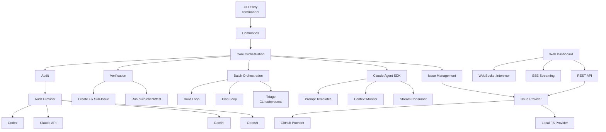

# Product Requirements Document: barf

**Version**: 2.0.0
**Last Updated**: 2026-02-26
**Status**: Active Development

## Executive Summary

**barf** (Backlog AI Resolution Framework) is a TypeScript CLI tool that orchestrates Claude AI agent work on project backlogs. It manages the full lifecycle of issue resolution—from triage and planning through implementation and verification—while automatically handling context overflow, state transitions, and quality validation.

**Core Value Proposition**: Enable developers to systematically work through backlogs using Claude AI while maintaining quality standards, reducing context management overhead, and ensuring completed work is verified before deployment.

---

## Problem Statement

### Current Pain Points

1. **Manual Context Management**: Developers must manually track when Claude approaches context limits, interrupting productive flow
2. **State Tracking Overhead**: No systematic way to track which issues are planned, in-progress, or completed across multiple Claude sessions
3. **Quality Assurance Gaps**: Completed work may not be verified against acceptance criteria or tested before integration
4. **Batch Processing Challenges**: No efficient way to queue and process multiple issues sequentially with AI assistance
5. **Context Overflow Failures**: Large issues cause Claude to hit context limits without automatic mitigation strategies

### Why This Matters

- **Developer Time**: Manual orchestration of AI-assisted development wastes 30-50% of time on overhead vs. actual implementation
- **Quality Risk**: Unverified AI-generated code introduces bugs and technical debt
- **Scalability**: Teams cannot systematically leverage AI for backlog reduction without process overhead
- **Predictability**: No reliable workflow for consistent AI-assisted issue resolution

---

## Goals & Objectives

### Primary Goals

1. **Automate AI Orchestration**: Reduce manual overhead of managing Claude sessions for issue resolution
2. **Ensure Quality**: Verify all completed work passes build, lint, and test suites before marking as done
3. **Handle Context Gracefully**: Automatically split issues or escalate to larger models when context limits approach
4. **Enable Batch Processing**: Allow unattended processing of multiple issues with automatic state tracking
5. **Maintain Traceability**: Preserve full audit trail of plan → implementation → verification for each issue

### Success Criteria

- Developers can queue issues and leave barf to process them autonomously
- >95% of completed issues pass verification on first attempt
- Context overflow handled without manual intervention
- Full state visibility: developers know which issues are planned, in-progress, verified
- Support both local file-based and GitHub Issues workflows

---

## User Personas

### Primary Persona: Solo Developer

**Name**: Alex (Indie Developer)
**Context**: Maintaining 2-3 open-source projects with growing backlogs
**Pain**: Can't keep up with issues; wants AI help but finds manual Claude sessions tedious
**Needs**:
- Queue issues for automated planning and implementation
- Verify work is actually done before closing issues
- Minimal setup and configuration

**Usage Pattern**:
```bash
barf init
# Add issues to issues/ directory
barf auto --batch 3  # Process 3 issues concurrently
```

### Secondary Persona: Small Team Lead

**Name**: Jordan (Team Lead, 3-5 developers)
**Context**: Managing GitHub Issues for a commercial product
**Pain**: Wants AI to handle routine issues so team can focus on complex work
**Needs**:
- GitHub Issues integration (no separate issue tracking)
- Quality gates (build/test must pass)
- Audit trail for compliance

**Usage Pattern**:
```bash
barf init --provider github --repo myorg/product
barf auto  # Processes GitHub issues with barf:new label
barf audit --all  # Review completed work
```

---

## Use Cases

### UC-1: Automated Backlog Processing

**Actor**: Developer
**Trigger**: Developer has 10+ issues ready for implementation
**Flow**:
1. Developer creates issues in `issues/` directory with acceptance criteria
2. Runs `barf auto`
3. barf triages issues (NEW → GROOMED), writes plans (GROOMED → PLANNED), implements features (PLANNED → BUILT), verifies results (BUILT → COMPLETE)
4. Developer reviews verified issues and merges changes

**Success Outcome**: 80%+ of issues complete verification without manual intervention

### UC-2: Context Overflow Handling

**Actor**: System
**Trigger**: Claude context usage exceeds `CONTEXT_USAGE_PERCENT` threshold
**Flow**:
1. barf detects context at 75% (configurable) via async iterator on SDK stream
2. If `split_count < MAX_AUTO_SPLITS`: runs split prompt, creates child issues
3. Else: escalates to `EXTENDED_CONTEXT_MODEL` (e.g., claude-opus-4-6)
4. Continues processing without user intervention

**Success Outcome**: Large refactors complete without manual session restarts

### UC-3: Failed Verification Recovery

**Actor**: System
**Trigger**: Completed issue fails `bun run build`, `bun run check`, or `bun test`
**Flow**:
1. barf runs verification commands after Claude marks issue complete
2. On failure: creates fix sub-issue with `is_verify_fix=true` and error output
3. Claude attempts fix (up to `MAX_VERIFY_RETRIES` times)
4. If all retries exhausted: issue stays `BUILT` with `verify_exhausted=true`, logs failure

**Success Outcome**: Most verification failures self-heal; persistent failures flagged for manual review

### UC-4: GitHub Issues Workflow

**Actor**: Team using GitHub Issues
**Trigger**: Developer wants to process GitHub issues with AI
**Flow**:
1. Run `barf init --provider github --repo owner/repo`
2. barf creates `barf:new`, `barf:groomed`, `barf:planned`, etc. labels
3. Tag issues with `barf:new`
4. Run `barf auto`
5. barf processes issues, updates labels, writes plans to repo

**Success Outcome**: Team workflow stays in GitHub; no separate issue tracker needed

### UC-5: Issue Interview Flow

**Actor**: Developer + AI
**Trigger**: Triage determines issue requirements are under-specified
**Flow**:
1. `barf auto` triages a NEW issue and sets `needs_interview=true`
2. Clarifying questions appended to issue body
3. Developer runs `/barf-interview` Claude Code slash command to answer interactively
4. Interview evaluation determines if answers are sufficient (may ask follow-ups)
5. Once satisfied, issue moves to GROOMED and proceeds to planning

**Success Outcome**: Under-specified issues are fleshed out before wasting compute on planning

### UC-6: Web Dashboard Monitoring

**Actor**: Developer
**Trigger**: Developer wants real-time visibility into barf operations
**Flow**:
1. Developer runs `bun run dashboard` to start the web UI
2. Kanban board shows all issues by state with real-time updates
3. Developer can trigger plan/build/triage/audit commands from the UI
4. SSE streams show live Claude output during execution
5. Interactive interview flow available via WebSocket

**Success Outcome**: Full visibility and control without leaving the browser

---

## Features & Requirements

### Core Features

#### F-1: Issue State Machine

**Priority**: P0 (Must Have)
**Description**: Validated state transitions prevent invalid states

**States**:
- `NEW` → `GROOMED` → `PLANNED` → `BUILT` → `COMPLETE`
- Side-states: `STUCK`, `SPLIT` (terminal)

**Acceptance Criteria**:
- State transitions validated against `VALID_TRANSITIONS` map
- Invalid transitions rejected with `InvalidTransitionError`
- `needs_interview` flag orthogonal to state (set by triage)

#### F-2: Automated Triage

**Priority**: P0 (Must Have)
**Description**: Fast Claude call evaluates if issue has clear requirements

**Behavior**:
- Uses `TRIAGE_MODEL` (claude-haiku-4-5 for speed/cost) via CLI subprocess
- Sets `needs_interview=false` + transitions to `GROOMED` if requirements clear
- Sets `needs_interview=true` + appends questions to issue body if under-specified
- Developer runs `/barf-interview` Claude Code skill to answer questions before planning

**Acceptance Criteria**:
- Triage completes in <10 seconds per issue
- Clear issues proceed to planning without delay
- Under-specified issues blocked until interview completes

#### F-3: Automated Planning

**Priority**: P0 (Must Have)
**Description**: Claude explores codebase and writes implementation plan

**Behavior**:
- Uses `PLAN_MODEL` via Claude Agent SDK
- Reads issue + acceptance criteria + AGENTS.md
- Uses Glob/Grep to explore relevant code (parallel subagents)
- Writes plan to `PLAN_DIR/{issueId}.md`
- barf detects plan file → transitions `GROOMED → PLANNED`

**Acceptance Criteria**:
- Plan references specific files and line numbers
- Plan includes step-by-step TDD implementation strategy
- Plan considers existing patterns and conventions

#### F-4: Automated Build

**Priority**: P0 (Must Have)
**Description**: Claude implements plan, checking acceptance criteria between iterations

**Behavior**:
- Uses `BUILD_MODEL` via Claude Agent SDK
- Reads plan file, implements changes iteratively
- Checks acceptance criteria after each iteration
- Transitions `PLANNED → BUILT` when all criteria met (stays PLANNED while building)
- Runs pre-complete fix commands and test command before completion

**Acceptance Criteria**:
- Acceptance criteria checkboxes (`- [ ]`) tracked
- Issue marked `BUILT` only when all become `- [x]`
- Max iterations configurable via `MAX_ITERATIONS`

#### F-5: Automated Verification

**Priority**: P0 (Must Have)
**Description**: Run build, lint, and tests after completion; fix or fail

**Behavior**:
- After `BUILT`, runs `bun run build`, `bun run check`, `bun test`
- If all pass: `BUILT → COMPLETE`
- If any fail: creates fix sub-issue with `is_verify_fix=true`, retries up to `MAX_VERIFY_RETRIES`
- If retries exhausted: stays `BUILT` with `verify_exhausted=true`

**Acceptance Criteria**:
- Verification runs after every completion
- Fix sub-issues include full error output (stdout/stderr per check)
- Retry limit prevents infinite loops

#### F-6: Context Overflow Mitigation

**Priority**: P0 (Must Have)
**Description**: Automatically split or escalate when context fills

**Strategy**:
```
if input_tokens >= threshold (contextUsagePercent% of model limit):
  if split_count < MAX_AUTO_SPLITS:
    run split prompt → create child issues → plan each child
  else:
    switch to EXTENDED_CONTEXT_MODEL → continue
```

**Acceptance Criteria**:
- Context monitoring via async iterator on SDK stream (tracks main-context tokens only)
- Split prompt decomposes issue into well-defined children
- Escalation switches model and continues in same loop

#### F-7: Provider Abstraction

**Priority**: P1 (Should Have)
**Description**: Pluggable backends for issue storage

**Providers**:
- **Local**: Frontmatter markdown files in `ISSUES_DIR` (POSIX `O_CREAT|O_EXCL` atomic locking, stale lock sweep)
- **GitHub**: GitHub Issues via `gh` CLI (label-based state mapping, `barf:locked` label for locking)

**Acceptance Criteria**:
- `IssueProvider` abstract class with `fetchIssue`, `listIssues`, `createIssue`, `writeIssue`, `deleteIssue`, `lockIssue`, `unlockIssue`, `isLocked`
- Factory pattern selects provider from `ISSUE_PROVIDER` config
- Adding new provider requires only extending abstract class

#### F-8: AI Audit

**Priority**: P2 (Nice to Have)
**Description**: External AI reviews completed work for quality/compliance

**Behavior**:
- Uses `AUDIT_PROVIDER` (openai | gemini | claude | codex)
- Phase 1: runs test, lint, format checks in parallel
- Phase 2: loads project rules (`.claude/rules/*.md`), sends audit prompt with results
- Validates response against `AuditResponseSchema` (Zod)
- On failure: creates findings issue via `provider.createIssue()`

**Acceptance Criteria**:
- Audit results include severity, category, affected files
- Categories: `failing_check`, `unmet_criteria`, `rule_violation`, `production_readiness`
- Configurable per-provider models

#### F-9: Interview Flow

**Priority**: P1 (Should Have)
**Description**: Interactive clarification of under-specified issues

**Behavior**:
- Triage sets `needs_interview=true` and appends questions to issue body
- `/barf-interview` Claude Code slash command conducts interactive Q&A
- `interview_eval` prompt evaluates answer sufficiency, may ask follow-ups
- Max 5 questions per turn, 2-3 follow-ups per evaluation

**Acceptance Criteria**:
- Interview questions are specific and actionable
- Evaluation prevents premature completion of under-specified issues
- Once satisfied, issue proceeds to GROOMED → planning

#### F-10: Web Dashboard

**Priority**: P2 (Nice to Have)
**Description**: Browser-based UI for monitoring and controlling barf

**Behavior**:
- Bun HTTP server (default port 3333) with REST API, SSE, and WebSocket
- Kanban board showing issues grouped by state
- Real-time command streaming (plan, build, triage, audit, auto) via SSE
- Interactive interview flow via WebSocket subprocess
- Issue editor, config editor, activity log

**Acceptance Criteria**:
- Dashboard reflects issue state changes in real-time
- Commands can be triggered and monitored from the UI
- Config changes persist to `.barfrc` preserving comments

### Non-Functional Requirements

#### NFR-1: Reliability

- **SDK Integration**: Claude Agent SDK with `bypassPermissions` mode; auto-compact disabled (barf controls context)
- **Locking**: POSIX atomic locking (local) or label-based (GitHub) prevents concurrent access; dead-PID sweep on construction
- **Timeouts**: `CLAUDE_TIMEOUT` aborts via AbortController
- **Error Handling**: All I/O returns `Result`/`ResultAsync`; no thrown errors except CLI boundary
- **Error Tracking**: Optional Sentry integration (`SENTRY_DSN`) for production monitoring

#### NFR-2: Observability

- **Structured Logging**: Pino JSON to stderr + configurable log file (`LOG_FILE`)
- **Stream Logging**: Raw Claude SDK output to `.barf/streams/{issueId}.jsonl` (unless `DISABLE_LOG_STREAM`)
- **State Visibility**: `barf status` shows all issues + current state (text or JSON format)
- **Session Stats**: Per-issue cumulative token counts, duration, and iteration counts persisted to frontmatter
- **Dashboard Stats**: `__BARF_STATS__:` structured JSON lines emitted per iteration for dashboard consumption
- **Web Dashboard**: `bun run dashboard` serves a Preact-based dashboard with SSE + WebSocket for real-time monitoring

#### NFR-3: Performance

- **Batch Builds**: `--batch N` runs N issues concurrently via `Promise.allSettled` (default: 1)
- **Fast Triage**: Haiku model via CLI subprocess completes triage in <10s per issue
- **Incremental Planning**: Plan files prevent re-planning on retry
- **Compile-time Prompts**: Templates embedded via Bun import attributes; no runtime file I/O for defaults

#### NFR-4: Security

- **Shell Injection Prevention**: `execFileNoThrow` uses `Bun.spawn` with args array, never shell strings
- **Secret Management**: API keys in `.barfrc` (not committed) or `~/.codex/auth.json` fallback
- **Validation**: All external input validated via Zod 4 schemas
- **SDK Isolation**: `settingSources: []` — no CLAUDE.md loaded by SDK; all context from prompt only

---

## Technical Architecture

### System Components



### Key Design Decisions

#### Claude Agent SDK (not subprocess)

**Decision**: Main orchestration (plan/build/split) uses `@anthropic-ai/claude-agent-sdk` directly
**Rationale**: Direct SDK control over permissions, auto-compact, and token tracking
**Exception**: Triage still uses CLI subprocess for one-shot calls (`claude -p`)

#### State Machine Enforcement

**Decision**: All state transitions validated through `validateTransition()`
**Rationale**: Bash version had bugs from unchecked state mutations
**Trade-off**: Slightly more verbose, but eliminates entire class of bugs

#### No Global State

**Decision**: Pass `Issue` objects as function arguments; no global `ISSUE_ID`/`STATE`
**Rationale**: Bash globals caused race conditions in concurrent execution
**Trade-off**: More parameter passing, but thread-safe and testable

#### neverthrow for Error Handling

**Decision**: All I/O returns `Result<T, E>` or `ResultAsync<T, E>`
**Rationale**: Explicit error handling without exceptions; railway-oriented programming
**Trade-off**: More verbose than try/catch, but errors visible in types

#### Dependency Injection

**Decision**: All core functions accept injectable dependencies (`RunLoopDeps`, `AutoDeps`, `AuditDeps`, `ExecFn`)
**Rationale**: Enables comprehensive unit testing with mocks (488 tests across 42 files)
**Trade-off**: Additional type complexity, but full testability without I/O

#### Async Stream Parsing

**Decision**: Monitor SDK stream for context usage via async iterator
**Rationale**: Real-time detection without polling or hooks
**Trade-off**: More complex than post-execution parsing, but catches overflow mid-conversation

#### Frontmatter Markdown for Issues

**Decision**: `KEY=VALUE` frontmatter + markdown body
**Rationale**: Git-trackable, human-readable, no DB setup
**Trade-off**: No relational queries, but sufficient for single-agent use

---

## Configuration

### .barfrc Schema

| Key | Type | Default | Description |
|-----|------|---------|-------------|
| `ISSUE_PROVIDER` | `local \| github` | `local` | Issue storage backend |
| `GITHUB_REPO` | `owner/repo` | — | Required when `ISSUE_PROVIDER=github` |
| `BARF_DIR` | path | `.barf` | Internal state directory |
| `ISSUES_DIR` | path | `issues` | Issue file directory (local provider) |
| `PLAN_DIR` | path | `plans` | Plan file directory |
| `TRIAGE_MODEL` | model | `claude-haiku-4-5-20251001` | Triage model (fast/cheap, CLI subprocess) |
| `PLAN_MODEL` | model | `claude-opus-4-6` | Planning model (SDK) |
| `BUILD_MODEL` | model | `claude-sonnet-4-6` | Build model (SDK) |
| `SPLIT_MODEL` | model | `claude-sonnet-4-6` | Split model (SDK) |
| `EXTENDED_CONTEXT_MODEL` | model | `claude-opus-4-6` | Escalation model (SDK) |
| `AUDIT_PROVIDER` | `openai \| gemini \| claude \| codex` | `openai` | Audit AI provider |
| `AUDIT_MODEL` | model | `gpt-4o` | Provider-specific audit model |
| `CLAUDE_AUDIT_MODEL` | model | `claude-sonnet-4-6` | Claude audit provider model |
| `GEMINI_MODEL` | model | `gemini-1.5-pro` | Gemini audit provider model |
| `CONTEXT_USAGE_PERCENT` | 1-100 | `75` | Context threshold for overflow action |
| `MAX_AUTO_SPLITS` | int | `3` | Max splits before escalation |
| `MAX_ITERATIONS` | int | `0` | Max build iterations (0 = unlimited) |
| `MAX_VERIFY_RETRIES` | int | `3` | Max verification retry attempts |
| `CLAUDE_TIMEOUT` | seconds | `3600` | Claude timeout via AbortController |
| `TEST_COMMAND` | shell | — | Run after each build iteration |
| `FIX_COMMANDS` | comma-sep | — | Best-effort fix commands before test |
| `PUSH_STRATEGY` | `iteration \| on_complete \| manual` | `iteration` | When to git push |
| `PROMPT_DIR` | path | — | Custom prompt template directory |
| `DISABLE_LOG_STREAM` | boolean | `false` | Disable raw Claude JSONL stream logs |
| `LOG_FILE` | path | `.barf/barf.jsonl` | Structured log file |
| `LOG_LEVEL` | string | `info` | Pino log level |
| `LOG_PRETTY` | boolean | `false` | Human-readable logs |
| `SENTRY_DSN` | string | — | Sentry error tracking (empty = disabled) |
| `SENTRY_ENVIRONMENT` | string | `development` | Sentry environment tag |
| `SENTRY_TRACES_SAMPLE_RATE` | float | `0.2` | Sentry tracing sample rate |

### API Keys

| Key | Source | Notes |
|-----|--------|-------|
| `OPENAI_API_KEY` | `.barfrc` or `~/.codex/auth.json` | Required for `AUDIT_PROVIDER=openai` |
| `GEMINI_API_KEY` | `.barfrc` | Required for `AUDIT_PROVIDER=gemini` |
| `ANTHROPIC_API_KEY` | `.barfrc` | Required for `AUDIT_PROVIDER=claude` |

---

## Success Metrics

### Quantitative Metrics

| Metric | Target | Measurement |
|--------|--------|-------------|
| **Verification Pass Rate** | >95% | % of `COMPLETED` issues that reach `VERIFIED` without manual fixes |
| **Context Overflow Success** | 100% | % of overflow events handled without manual intervention |
| **Triage Accuracy** | >90% | % of triaged issues that successfully complete planning |
| **Build Success Rate** | >80% | % of planned issues that reach `COMPLETED` |
| **Concurrent Batch Throughput** | 3x | Speed improvement of `--batch 3` vs `--batch 1` |

### Qualitative Metrics

- **Developer Confidence**: Survey developers on trust in auto-verified work
- **Setup Friction**: Measure time from `barf init` to first successful auto run
- **Error Clarity**: User feedback on error message helpfulness

---

## Future Roadmap

### Phase 2 (Q2 2026)

- [ ] **Multi-Agent Locking**: Support concurrent `barf auto` processes on different issues
- [ ] **GitLab/Linear Providers**: Add provider implementations for GitLab Issues, Linear
- [ ] **Custom Audit Rules**: Per-project audit rulesets beyond global `.claude/rules/*.md`
- [ ] **Dashboard Improvements**: Enhanced real-time dashboard with filtering and analytics

### Phase 3 (Q3 2026)

- [ ] **Team Workflows**: Issue assignment, review queues, approval gates
- [ ] **Metrics Dashboard**: Persistent metrics for tracking verification rates, common failures
- [ ] **Plugin System**: Extensible hooks for custom pre/post-build logic
- [ ] **Cloud Sync**: Optional cloud backend for cross-machine issue state

### Research & Exploration

- **Agentic Code Review**: Auto-review sub-agent before verification
- **Smart Batching**: ML-based issue batching for optimal concurrency
- **Cost Optimization**: Automatic model selection based on issue complexity
- **Rollback on Verification Failure**: Auto-revert changes if verification fails N times

---

## Appendix

### Glossary

- **Issue**: Unit of work with frontmatter metadata + markdown body
- **Plan**: Implementation strategy written by Claude before build phase
- **Acceptance Criteria**: Checklist in issue body defining "done"
- **Verification**: Automated build/lint/test run after completion
- **Triage**: Fast AI evaluation of issue clarity
- **Groomed**: Post-triage state indicating requirements are clear
- **Interview**: Interactive Q&A to clarify under-specified issues
- **Split**: Decomposition of large issue into child issues
- **Escalation**: Switch to larger context model when splits exhausted
- **Provider**: Pluggable backend for issue storage (local, GitHub)
- **Audit Provider**: Pluggable AI backend for code review (OpenAI, Gemini, Claude, Codex)
- **Dashboard**: Web UI for monitoring and controlling barf operations

### References

- [Bun](https://bun.sh) — JavaScript runtime and toolkit
- [Claude Agent SDK](https://www.npmjs.com/package/@anthropic-ai/claude-agent-sdk) — Anthropic Claude Agent SDK
- [neverthrow](https://github.com/supermacro/neverthrow) — Type-safe error handling
- [Zod 4](https://zod.dev) — TypeScript-first schema validation
- [Pino](https://getpino.io/) — Fast JSON logger for Node.js

---

**Document Owner**: Daniel
**Last Review**: 2026-02-26
**Next Review**: 2026-03-26
