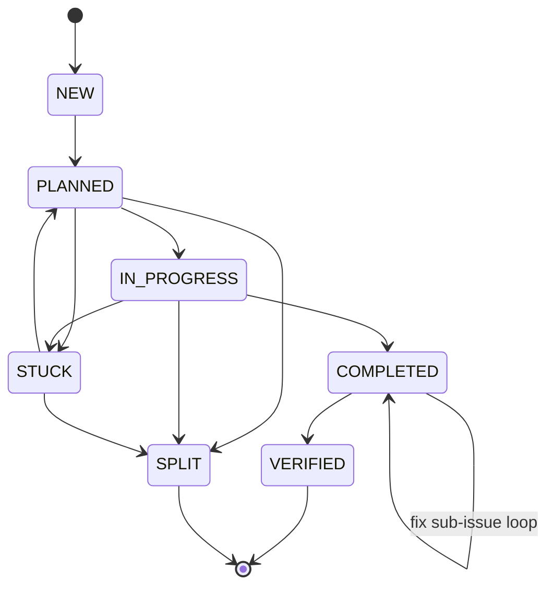

# barf

AI issue orchestration CLI. Feeds issues to Claude one at a time, tracks state, and handles context overflow automatically.

```
barf plan        # Claude writes an implementation plan
barf build       # Claude implements the plan
barf audit       # audit completed work with an AI provider
barf auto        # orchestrate all stages automatically
```

## How it works

Each issue is a markdown file with frontmatter. The full lifecycle:

1. **Triage** — A fast one-shot Claude call evaluates each `NEW` issue. If the requirements are clear, `needs_interview=false` is set and planning proceeds. If not, `needs_interview=true` is set and questions are appended to the issue body for the `/barf-interview` Claude Code slash command.
2. **Plan** — Claude reads the issue, explores the codebase, writes a plan file (`NEW → PLANNED`)
3. **Build** — Claude implements the plan, checking acceptance criteria between iterations (`PLANNED → COMPLETED`)
4. **Verify** — After `COMPLETED`, barf runs `bun run build`, `bun run check`, and `bun test`. If all pass, the issue transitions to `VERIFIED`. If they fail, a fix sub-issue is created and the loop iterates until all checks pass or `MAX_VERIFY_RETRIES` is exhausted.
5. **Audit** — An AI provider reviews the completed work for quality and rule compliance

`barf auto` runs all stages in sequence — triage `NEW` issues, plan ready issues, build `PLANNED` issues, verify `COMPLETED` issues.

When Claude's context fills up, barf either escalates to a larger model or splits the issue into sub-issues automatically.

## Installation

Requires [Bun](https://bun.sh) and the [Claude CLI](https://claude.ai/download).

```bash
git clone <repo>
cd barf-ts
bun install
bun run build            # compiles to dist/barf
cp dist/barf /usr/local/bin/barf
```

Or run from source:

```bash
bun run dev <command>
```

## Setup

```bash
cd your-project
barf init                          # local issues (default)
barf init --provider github --repo owner/repo   # GitHub Issues
```

`barf init` creates the issues and plans directories, writes a `.barfrc` config file, and (for GitHub) creates the `barf:*` label set.

You can also target a project without changing directory using the global `--cwd` flag:

```bash
barf --cwd ~/projects/myapp status
barf --cwd ~/projects/myapp plan --issue 003
```

`--cwd` is accepted by all commands and is equivalent to running barf from inside that directory.

## Issue format

Issues are markdown files in `issues/` (or whichever `ISSUES_DIR` you configure):

```markdown
---
id=001
title=Add user authentication
state=NEW
parent=
children=
split_count=0
context_usage_percent=90
---

Implement JWT-based authentication for the API.

## Acceptance Criteria

- [ ] POST /auth/login returns a signed JWT
- [ ] Middleware validates token on protected routes
- [ ] Expired tokens return 401
```

The frontmatter block uses `KEY=VALUE` syntax. The body is free-form markdown. Acceptance criteria are detected by the `## Acceptance Criteria` section — barf considers the issue done when all `- [ ]` checkboxes become `- [x]`.

The optional `context_usage_percent` field overrides the global `CONTEXT_USAGE_PERCENT` for this issue only. Useful for large refactors that need more context before triggering overflow/split. Valid range: 1–100. When absent, the global config value is used.

## Issue states



| State | Meaning |
|-------|---------|
| `NEW` | Created, awaiting triage |
| `PLANNED` | Plan file exists, ready to build |
| `IN_PROGRESS` | Claude is actively working on it |
| `STUCK` | Blocked, needs human intervention or re-planning |
| `SPLIT` | Split into sub-issues (terminal) |
| `COMPLETED` | All acceptance criteria met; awaiting automated verification |
| `VERIFIED` | Build, lint, and tests pass — truly done (terminal) |

The `needs_interview` field on an issue (`true`/`false`/unset) is separate from state. When `barf auto` triages a `NEW` issue and finds it under-specified, it sets `needs_interview=true` and appends clarifying questions to the issue body. Run `/barf-interview` as a Claude Code slash command to answer them before planning.

## Commands

All commands accept global `--cwd <path>` and `--config <path>` options.

### `barf init`

```
barf init [--provider local|github] [--repo owner/repo]
```

Creates issue/plan directories and writes `.barfrc`. Safe to re-run.

### `barf status`

```
barf status [--format text|json]
```

Lists all issues and their current state.

### `barf plan`

```
barf plan [--issue <id>]
```

Runs Claude to plan an issue (`NEW → PLANNED`). Auto-selects the first plannable `NEW` issue if `--issue` is omitted. Claude reads the issue, explores the codebase, and writes a plan file to `PLAN_DIR/<id>.md`.

### `barf build`

```
barf build [--issue <id>] [--batch <n>] [--max <n>]
```

Runs Claude to implement an issue (`PLANNED → COMPLETED`). Auto-selects the highest-priority buildable issue if `--issue` is omitted.

- `--batch <n>` — build up to `n` issues concurrently (default: 1)
- `--max <n>` — override max iterations for this run (0 = unlimited)

### `barf auto`

```
barf auto [--batch <n>] [--max <n>]
```

Auto-orchestrate all stages: triage `NEW` issues, plan ready issues, build `PLANNED`/`IN_PROGRESS` issues. Runs the full lifecycle without manual intervention. Issues with `needs_interview=true` are skipped for planning — run `/barf-interview` first.

- `--batch <n>` — max concurrent builds (default: 1)
- `--max <n>` — max iterations per issue (0 = unlimited)

### `barf audit`

```
barf audit [--issue <id>] [--all]
```

Audits completed issues for quality and rule compliance using a configured AI provider (OpenAI, Gemini, or Claude). Defaults to auditing all `COMPLETED` issues.

## Configuration

`.barfrc` in your project root uses `KEY=VALUE` format:

```bash
ISSUE_PROVIDER=local        # local | github
GITHUB_REPO=owner/repo      # required when ISSUE_PROVIDER=github

BARF_DIR=.barf              # directory for locks and internal state
ISSUES_DIR=issues           # where issue files live
PLAN_DIR=plans              # where plan files are saved

TRIAGE_MODEL=claude-haiku-4-5-20251001  # model used for auto-triage
PLAN_MODEL=claude-opus-4-6              # model used for barf plan
BUILD_MODEL=claude-sonnet-4-6           # model used for barf build
SPLIT_MODEL=claude-sonnet-4-6           # model used when splitting
EXTENDED_CONTEXT_MODEL=claude-opus-4-6  # model used when escalating

AUDIT_PROVIDER=openai               # openai | gemini | claude
AUDIT_MODEL=gpt-4o                  # model used for barf audit (provider-specific)
OPENAI_API_KEY=                     # required when AUDIT_PROVIDER=openai
GEMINI_API_KEY=                     # required when AUDIT_PROVIDER=gemini
ANTHROPIC_API_KEY=                  # required when AUDIT_PROVIDER=claude

CONTEXT_USAGE_PERCENT=75    # interrupt Claude at this % of context window
MAX_AUTO_SPLITS=3           # max splits before escalating to larger model
MAX_VERIFY_RETRIES=3        # max verification attempts before giving up (leaves as COMPLETED)
MAX_ITERATIONS=0            # max build iterations per issue (0 = unlimited)
CLAUDE_TIMEOUT=3600         # seconds before killing a Claude process

TEST_COMMAND=               # run after each build iteration (e.g. "bun test")
PUSH_STRATEGY=iteration     # iteration | on_complete | manual

PROMPT_DIR=                 # directory for custom prompt templates (empty = use built-in)
STREAM_LOG_DIR=             # directory for raw Claude stream logs (empty = disabled)
```

When `PROMPT_DIR` is set, barf checks for `PROMPT_DIR/PROMPT_<mode>.md` before using the compiled-in template for any of the five modes: `plan`, `build`, `split`, `audit`, `triage`. Missing files fall back to built-in. This lets you customise prompts per-project without modifying barf source. Files are re-read each iteration, so you can edit them during long runs.

When `STREAM_LOG_DIR` is set, each issue's raw Claude output is appended to `{STREAM_LOG_DIR}/{issueId}.jsonl` as JSONL — exactly as emitted by `--output-format stream-json`. Multiple iterations of the same issue append to the same file. Useful for debugging and auditing Claude's raw output.

## Context overflow

When Claude approaches the context limit (`CONTEXT_USAGE_PERCENT`), barf decides:

1. **Split** (if `split_count < MAX_AUTO_SPLITS`): runs a split prompt, decomposes the issue into child issues, then plans each child automatically.
2. **Escalate** (if `split_count >= MAX_AUTO_SPLITS`): switches to `EXTENDED_CONTEXT_MODEL` and continues.

## GitHub provider

The GitHub provider maps barf states to labels (`barf:new`, `barf:planned`, etc.). Locking uses a `barf:locked` label — designed for single-agent use.

```bash
barf init --provider github --repo myorg/myrepo
barf plan --issue 42    # GitHub issue #42
```

Requires `gh auth login`.

## Development

```bash
bun install                    # install deps
git submodule update --init    # fetch tests/sample-project
bun test                       # run tests (377 tests)
bun run build                  # compile binary to dist/barf
bun run format                 # format with oxfmt
bun run lint                   # lint with oxlint
bun run check                  # format:check + lint (CI gate)
bun run docs                   # generate API docs to docs/api/
```

`tests/sample-project` is a git submodule used for manual end-to-end testing via `barf --cwd tests/sample-project`. Initialize it once after cloning with `git submodule update --init`.

### Logging

Structured JSON to stderr by default. For human-readable output:

```bash
LOG_PRETTY=1 barf build
LOG_LEVEL=debug barf plan --issue 001
```

### Project layout

```
src/
  index.ts                    CLI entry (commander)
  cli/commands/               init  status  plan  build  auto  audit
  core/
    issue/
      index.ts                frontmatter parser, state machine
      base.ts                 abstract IssueProvider
      factory.ts              provider factory
      providers/
        local.ts              file-system provider (POSIX mkdir locking)
        github.ts             GitHub Issues provider (gh CLI)
    config.ts                 .barfrc parser
    context.ts                Claude stream parser, prompt injection
    claude.ts                 Claude subprocess wrapper
    prompts.ts                runtime prompt template resolution (plan/build/split/audit/triage)
    batch.ts                  orchestration loop (plan/build/split/verify)
    triage.ts                 one-shot triage call (NEW issues → needs_interview flag)
    verification.ts           post-COMPLETED verification (build/check/test → VERIFIED)
    openai.ts                 OpenAI API client
    audit-schema.ts           audit result Zod schemas
  providers/                  pluggable audit providers (openai, gemini, claude)
  types/
    index.ts                  Zod schemas + inferred types
    assets.d.ts               .md text import declaration for Bun
  utils/
    execFileNoThrow.ts        shell-injection-safe subprocess
    logger.ts                 pino logger
    toError.ts                unknown → Error coercion
    syncToResultAsync.ts      sync Result → ResultAsync bridge
  prompts/
    PROMPT_plan.md            planning prompt template
    PROMPT_build.md           build prompt template
    PROMPT_split.md           split prompt template
    PROMPT_audit.md           audit prompt template
    PROMPT_triage.md          triage prompt template
tests/
  unit/                       413 tests across 38 files
  fixtures/                   test helpers (mock provider, etc.)
  sample-project/             sample project for manual testing (barf --cwd tests/sample-project)
```
