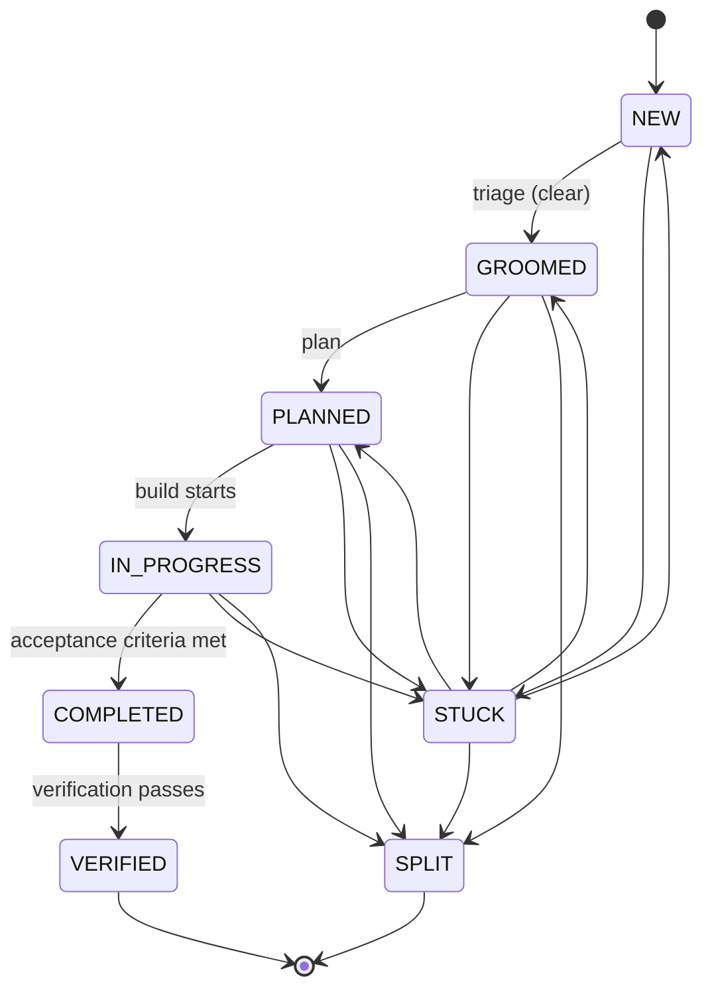

# barf

AI issue orchestration CLI. Feeds issues to Claude one at a time, tracks state, and handles context overflow automatically.

```
barf plan        # Claude writes an implementation plan
barf build       # Claude implements the plan
barf audit       # audit completed work with an AI provider
barf auto        # orchestrate all stages automatically
```

## Documentation

- [Architecture Overview](docs/architecture.md) — system design, layer diagram, data flows
- [Adding a Command](docs/guides/adding-a-command.md) — how to add a new CLI command
- [Adding an Audit Provider](docs/guides/adding-an-audit-provider.md) — how to extend the audit system
- [Issue Lifecycle](docs/guides/issue-lifecycle.md) — deep dive on the state machine
- [API Reference](docs/api/) — generated from source with TypeDoc (`bun run docs`)

## How it works

Each issue is a markdown file with frontmatter. The full lifecycle:

1. **Triage** — A fast one-shot Claude call evaluates each `NEW` issue. If the requirements are clear, the issue moves to `GROOMED`. If not, `needs_interview=true` is set and questions are appended to the issue body for the `/barf-interview` Claude Code slash command.
2. **Plan** — Claude reads the issue, explores the codebase, writes a plan file (`GROOMED → PLANNED`)
3. **Build** — Claude implements the plan, checking acceptance criteria between iterations (`PLANNED → IN_PROGRESS → COMPLETED`)
4. **Verify** — After `COMPLETED`, barf runs `bun run build`, `bun run check`, and `bun test`. If all pass, the issue transitions to `VERIFIED`. If they fail, a fix sub-issue is created and the loop iterates until all checks pass or `MAX_VERIFY_RETRIES` is exhausted.
5. **Audit** — An external AI provider reviews the completed work for quality and rule compliance

`barf auto` runs all stages in sequence — triage `NEW` issues, plan `GROOMED` issues, build `PLANNED` issues, verify `COMPLETED` issues.

When Claude's context fills up, barf either splits the issue into sub-issues or escalates to a larger model automatically.

## Installation

### Prerequisites

- [Claude CLI](https://claude.ai/download) — **required** (used by triage, plan, and build)
- [gh CLI](https://cli.github.com) — optional, needed for GitHub Issues provider and `barf update-check`

### Install from release (recommended)

Download the latest binary for your platform from [GitHub Releases](../../releases/latest), or use the install script:

```bash
# macOS / Linux (requires gh CLI authenticated with repo access)
bash install.sh

# Windows (PowerShell)
.\install.ps1
```

The install script detects your OS and architecture, downloads the correct binary, and places it in `~/.local/bin/barf` (or `%LOCALAPPDATA%\barf\bin` on Windows).

### Build from source

Requires [Bun](https://bun.sh).

```bash
git clone <repo>
cd barf-ts
bun install
bun run build            # compiles to dist/barf
cp dist/barf /usr/local/bin/barf
```

Or run from source without compiling:

```bash
bun run dev <command>
```

### Check for updates

```bash
barf update-check
```

## Setup

```bash
cd your-project
barf init                          # local issues (default)
barf init --provider github --repo owner/repo   # GitHub Issues
```

`barf init` creates the issues and plans directories, writes a `.barfrc` config file, and (for GitHub) creates the `barf:*` label set.

You can also target a project without changing directory using the global `--cwd` flag:

```bash
barf --cwd ~/projects/myapp status
barf --cwd ~/projects/myapp plan --issue 003
```

`--cwd` is accepted by all commands and is equivalent to running barf from inside that directory.

## Issue format

Issues are markdown files in `issues/` (or whichever `ISSUES_DIR` you configure):

```markdown
---
id=001
title=Add user authentication
state=NEW
parent=
children=
split_count=0
context_usage_percent=90
---

Implement JWT-based authentication for the API.

## Acceptance Criteria

- [ ] POST /auth/login returns a signed JWT
- [ ] Middleware validates token on protected routes
- [ ] Expired tokens return 401
```

The frontmatter block uses `KEY=VALUE` syntax. The body is free-form markdown. Acceptance criteria are detected by the `## Acceptance Criteria` section — barf considers the issue done when all `- [ ]` checkboxes become `- [x]`.

The optional `context_usage_percent` field overrides the global `CONTEXT_USAGE_PERCENT` for this issue only. Useful for large refactors that need more context before triggering overflow/split. Valid range: 1–100. When absent, the global config value is used.

### Additional frontmatter fields

These fields are managed by barf automatically — you normally don't need to set them manually:

| Field | Type | Default | Description |
|-------|------|---------|-------------|
| `force_split` | boolean | `false` | Skip build, enter split flow directly |
| `needs_interview` | boolean | unset | Triage flag: `false` = ready, `true` = needs clarification |
| `verify_count` | number | `0` | Number of verification attempts |
| `is_verify_fix` | boolean | unset | This issue was created to fix a verification failure |
| `verify_exhausted` | boolean | unset | Verification retries exceeded `MAX_VERIFY_RETRIES` |
| `total_input_tokens` | number | `0` | Cumulative input tokens across all runs |
| `total_output_tokens` | number | `0` | Cumulative output tokens across all runs |
| `total_duration_seconds` | number | `0` | Cumulative wall-clock seconds |
| `total_iterations` | number | `0` | Total SDK iterations |
| `run_count` | number | `0` | Number of barf sessions for this issue |

## Issue states



| State | Meaning |
|-------|---------|
| `NEW` | Created, awaiting triage |
| `GROOMED` | Triaged, requirements clear, ready for planning |
| `PLANNED` | Plan file exists, ready to build |
| `IN_PROGRESS` | Claude is actively working on it |
| `STUCK` | Blocked, needs human intervention or re-planning |
| `SPLIT` | Split into sub-issues (terminal) |
| `COMPLETED` | All acceptance criteria met; awaiting automated verification |
| `VERIFIED` | Build, lint, and tests pass — truly done (terminal) |

The `needs_interview` field on an issue (`true`/`false`/unset) is separate from state. When `barf auto` triages a `NEW` issue and finds it under-specified, it sets `needs_interview=true` and appends clarifying questions to the issue body. Run `/barf-interview` as a Claude Code slash command to answer them before planning.

## Commands

All commands accept global `--cwd <path>` and `--config <path>` options.

### `barf init`

```
barf init [--provider local|github] [--repo owner/repo]
```

Creates issue/plan directories and writes `.barfrc`. Safe to re-run. With `--provider github`, also creates `barf:*` labels on the repo (requires `gh auth login`).

### `barf status`

```
barf status [--format text|json]
```

Lists all issues and their current state.

### `barf triage`

```
barf triage --issue <id>
```

Runs a one-shot Claude evaluation on a single `NEW` issue. Sets `needs_interview=false` (→ `GROOMED`) if requirements are clear, or `needs_interview=true` with appended questions if under-specified.

### `barf plan`

```
barf plan [--issue <id>]
```

Runs Claude to plan an issue (`GROOMED → PLANNED`). Auto-selects the first plannable issue if `--issue` is omitted. Claude reads the issue, explores the codebase, and writes a plan file to `PLAN_DIR/<id>.md`.

### `barf build`

```
barf build [--issue <id>] [--batch <n>] [--max <n>]
```

Runs Claude to implement an issue (`PLANNED → IN_PROGRESS → COMPLETED`). Auto-selects the highest-priority buildable issue if `--issue` is omitted.

- `--batch <n>` — build up to `n` issues concurrently (default: 1)
- `--max <n>` — override max iterations for this run (0 = unlimited)

### `barf auto`

```
barf auto [--batch <n>] [--max <n>]
```

Auto-orchestrate all stages: triage `NEW` issues, plan `GROOMED` issues, build `PLANNED`/`IN_PROGRESS` issues, verify `COMPLETED` issues. Issues with `needs_interview=true` are skipped for planning — run `/barf-interview` first.

- `--batch <n>` — max concurrent builds (default: 1)
- `--max <n>` — max iterations per issue (0 = unlimited)

### `barf audit`

```
barf audit [--issue <id>] [--all]
```

Audits completed issues for quality and rule compliance using a configured AI provider (OpenAI, Gemini, Claude, or Codex). Defaults to auditing all `COMPLETED` issues.

## Configuration

`.barfrc` in your project root uses `KEY=VALUE` format:

```bash
ISSUE_PROVIDER=local        # local | github
GITHUB_REPO=owner/repo      # required when ISSUE_PROVIDER=github

BARF_DIR=.barf              # directory for locks, streams, and internal state
ISSUES_DIR=issues           # where issue files live
PLAN_DIR=plans              # where plan files are saved

TRIAGE_MODEL=claude-haiku-4-5-20251001  # model used for auto-triage
PLAN_MODEL=claude-opus-4-6              # model used for barf plan
BUILD_MODEL=claude-sonnet-4-6           # model used for barf build
SPLIT_MODEL=claude-sonnet-4-6           # model used when splitting
EXTENDED_CONTEXT_MODEL=claude-opus-4-6  # model used when escalating

AUDIT_PROVIDER=openai               # openai | gemini | claude | codex
AUDIT_MODEL=gpt-4o                  # model used for barf audit (provider-specific)
OPENAI_API_KEY=                     # required when AUDIT_PROVIDER=openai (also reads ~/.codex/auth.json)
GEMINI_API_KEY=                     # required when AUDIT_PROVIDER=gemini
GEMINI_MODEL=gemini-1.5-pro        # model for Gemini audit provider
ANTHROPIC_API_KEY=                  # required when AUDIT_PROVIDER=claude
CLAUDE_AUDIT_MODEL=claude-sonnet-4-6 # model for Claude audit provider

CONTEXT_USAGE_PERCENT=75    # interrupt Claude at this % of context window
MAX_AUTO_SPLITS=3           # max splits before escalating to larger model
MAX_ITERATIONS=0            # max build iterations per issue (0 = unlimited)
MAX_VERIFY_RETRIES=3        # max verification retry attempts before giving up
CLAUDE_TIMEOUT=3600         # seconds before killing a Claude process

TEST_COMMAND=               # run after each build iteration (e.g. "bun test")
FIX_COMMANDS=               # comma-separated commands to run before test (best-effort)
PUSH_STRATEGY=iteration     # iteration | on_complete | manual

PROMPT_DIR=                 # directory for custom prompt templates (empty = use built-in)
DISABLE_LOG_STREAM=false    # set to true to disable raw Claude JSONL stream logs

LOG_FILE=.barf/barf.jsonl   # structured log output file
LOG_LEVEL=info              # pino log level
LOG_PRETTY=false            # true for human-readable logs (dev only)

SENTRY_DSN=                 # Sentry error tracking DSN (empty = disabled)
SENTRY_ENVIRONMENT=development  # Sentry environment tag
SENTRY_TRACES_SAMPLE_RATE=0.2  # Sentry tracing sample rate (0.0-1.0)
```

When `PROMPT_DIR` is set, barf checks for `PROMPT_DIR/PROMPT_<mode>.md` before using the compiled-in template for any mode: `plan`, `build`, `split`, `audit`, `triage`, `interview_eval`. Missing files fall back to built-in. This lets you customise prompts per-project without modifying barf source. Files are re-read each iteration, so you can edit them during long runs.

When `DISABLE_LOG_STREAM` is not set (the default), each issue's raw Claude SDK output is appended to `.barf/streams/{issueId}.jsonl` as JSONL. Multiple iterations of the same issue append to the same file. Useful for debugging and auditing Claude's raw output.

## Context overflow

When Claude approaches the context limit (`CONTEXT_USAGE_PERCENT`), barf decides:

1. **Split** (if `split_count < MAX_AUTO_SPLITS`): runs a split prompt, decomposes the issue into child issues, then plans each child automatically.
2. **Escalate** (if `split_count >= MAX_AUTO_SPLITS`): switches to `EXTENDED_CONTEXT_MODEL` and continues.

Per-issue `context_usage_percent` in frontmatter overrides the global threshold.

## GitHub provider

The GitHub provider maps barf states to labels (`barf:new`, `barf:groomed`, `barf:planned`, etc.). Locking uses a `barf:locked` label — designed for single-agent use.

```bash
barf init --provider github --repo myorg/myrepo
barf plan --issue 42    # GitHub issue #42
```

Requires `gh auth login`.

## Web dashboard

barf includes a web dashboard for monitoring and managing issues:

```bash
bun run dashboard        # build frontend + start server on port 3333
```

Features:
- Kanban board with drag-and-drop state transitions
- Real-time command streaming via SSE (plan, build, triage, audit, auto)
- Interactive interview flow via WebSocket
- Activity log with parsed Claude SDK output
- Issue editor with CodeMirror
- Config editor (preserves `.barfrc` comments)

The dashboard uses Preact + `@preact/signals` for the frontend and DaisyUI/Tailwind for styling.

## Development

```bash
bun install                    # install deps
git submodule update --init    # fetch tests/sample-project
bun test                       # run tests (488 tests across 42 files)
bun run build                  # compile binary to dist/barf
bun run format                 # format with Biome
bun run lint                   # lint with Biome
bun run check                  # format + lint (CI gate)
bun run docs                   # generate API docs to docs/api/
bun run dashboard              # build + serve development dashboard
bun run dashboard:build        # build frontend only
```

`tests/sample-project` is a git submodule used for manual end-to-end testing via `barf --cwd tests/sample-project`. Initialize it once after cloning with `git submodule update --init`.

### Logging

Structured JSON to stderr by default. For human-readable output:

```bash
LOG_PRETTY=1 barf build
LOG_LEVEL=debug barf plan --issue 001
```
