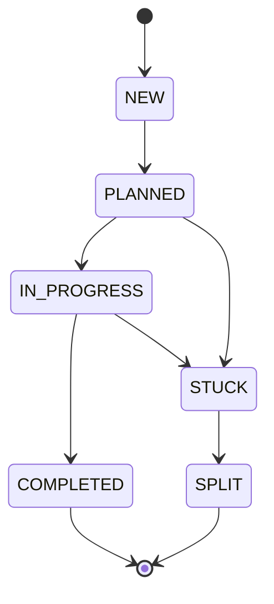

# barf

AI issue orchestration CLI. Feeds issues to Claude one at a time, tracks state, and handles context overflow automatically.

```
barf plan        # NEW → PLANNED  (Claude writes an implementation plan)
barf build       # PLANNED → COMPLETED  (Claude implements the plan)
barf --cwd /path/to/project status   # target a specific project directory
```

## How it works

Each issue is a markdown file with frontmatter. `barf plan` runs Claude with your issue as context and saves a plan file. `barf build` runs Claude again to implement the plan, checking acceptance criteria between iterations.

When Claude's context fills up, barf either escalates to a larger model or splits the issue into sub-issues automatically.

## Installation

Requires [Bun](https://bun.sh) and the [Claude CLI](https://claude.ai/download).

```bash
git clone <repo>
cd barf-ts
bun install
bun run build            # compiles to dist/barf
cp dist/barf /usr/local/bin/barf
```

Or run from source:

```bash
bun run dev <command>
```

## Setup

```bash
cd your-project
barf init                          # local issues (default)
barf init --provider github --repo owner/repo   # GitHub Issues
```

`barf init` creates the issues and plans directories, writes a `.barfrc` config file, and (for GitHub) creates the `barf:*` label set.

You can also target a project without changing directory using the global `--cwd` flag:

```bash
barf --cwd ~/projects/myapp status
barf --cwd ~/projects/myapp plan --issue 003
```

`--cwd` is accepted by all commands and is equivalent to running barf from inside that directory.

## Issue format

Issues are markdown files in `.barf/issues/` (or whichever `ISSUES_DIR` you configure):

```markdown
---
id=001
title=Add user authentication
state=NEW
parent=
children=
split_count=0
---

Implement JWT-based authentication for the API.

## Acceptance Criteria

- [ ] POST /auth/login returns a signed JWT
- [ ] Middleware validates token on protected routes
- [ ] Expired tokens return 401
```

The frontmatter block uses `KEY=VALUE` syntax. The body is free-form markdown. Acceptance criteria are detected by the `## Acceptance Criteria` section — barf considers the issue done when all `- [ ]` checkboxes become `- [x]`.

## Issue states



| State | Meaning |
|-------|---------|
| `NEW` | Created, not yet planned |
| `PLANNED` | Plan file exists, ready to build |
| `IN_PROGRESS` | Claude is actively working on it |
| `STUCK` | Blocked, needs human intervention |
| `SPLIT` | Split into sub-issues (terminal) |
| `COMPLETED` | All acceptance criteria met |

## Commands

All commands accept a global `--cwd <path>` option to target a project directory without `cd`-ing into it.

### `barf init`

```
barf init [--provider local|github] [--repo owner/repo]
```

Creates issue/plan directories and writes `.barfrc`. Safe to re-run.

### `barf status`

```
barf status [--format text|json]
```

Lists all issues and their current state.

### `barf plan`

```
barf plan [--issue <id>]
```

Runs Claude to plan an issue (`NEW → PLANNED`). Auto-selects the first `NEW` issue if `--issue` is omitted. Claude reads the issue, explores the codebase, and writes a plan file to `PLAN_DIR/<id>.md`.

### `barf build`

```
barf build [--issue <id>] [--batch <n>] [--max <n>]
```

Runs Claude to implement an issue (`PLANNED → COMPLETED`). Auto-selects the highest-priority buildable issue if `--issue` is omitted.

- `--batch <n>` — build up to `n` issues concurrently (default: 1)
- `--max <n>` — override max iterations for this run (0 = unlimited)

## Configuration

`.barfrc` in your project root uses `KEY=VALUE` format:

```bash
ISSUE_PROVIDER=local        # local | github
GITHUB_REPO=owner/repo      # required when ISSUE_PROVIDER=github

ISSUES_DIR=.barf/issues     # where issue files live
PLAN_DIR=.barf/plans        # where plan files are saved

PLAN_MODEL=claude-opus-4-6          # model used for barf plan
BUILD_MODEL=claude-sonnet-4-6       # model used for barf build
SPLIT_MODEL=claude-sonnet-4-6       # model used when splitting
EXTENDED_CONTEXT_MODEL=claude-opus-4-6  # model used when escalating

CONTEXT_USAGE_PERCENT=75    # interrupt Claude at this % of context window
MAX_AUTO_SPLITS=3           # max splits before escalating to larger model
MAX_ITERATIONS=0            # max build iterations per issue (0 = unlimited)
CLAUDE_TIMEOUT=3600         # seconds before killing a Claude process

TEST_COMMAND=               # run after each iteration (e.g. "bun test")
PUSH_STRATEGY=iteration     # iteration | on_complete | manual

STREAM_LOG_DIR=             # directory for raw Claude stream logs (empty = disabled)
```

When `STREAM_LOG_DIR` is set, each issue's raw Claude output is appended to `{STREAM_LOG_DIR}/{issueId}.jsonl` as JSONL — exactly as emitted by `--output-format stream-json`. Multiple iterations of the same issue append to the same file. Useful for debugging and auditing Claude's raw output.

## Context overflow

When Claude approaches the context limit (`CONTEXT_USAGE_PERCENT`), barf decides:

1. **Split** (if `split_count < MAX_AUTO_SPLITS`): runs a split prompt, decomposes the issue into child issues, then plans each child automatically.
2. **Escalate** (if `split_count >= MAX_AUTO_SPLITS`): switches to `EXTENDED_CONTEXT_MODEL` and continues.

## GitHub provider

The GitHub provider maps barf states to labels (`barf:new`, `barf:planned`, etc.). Locking uses a `barf:locked` label — designed for single-agent use.

```bash
barf init --provider github --repo myorg/myrepo
barf plan --issue 42    # GitHub issue #42
```

Requires `gh auth login`.

## Development

```bash
bun install                    # install deps
git submodule update --init    # fetch tests/sample-project
bun test                       # run tests (92 tests)
bun run build        # compile binary to dist/barf
bun run format       # format with oxfmt
bun run lint         # lint with oxlint
bun run check        # format:check + lint (CI gate)
bun run docs         # generate API docs to docs/api/
```

`tests/sample-project` is a git submodule used for manual end-to-end testing via `barf --cwd tests/sample-project`. Initialize it once after cloning with `git submodule update --init`.

### Logging

Structured JSON to stderr by default. For human-readable output:

```bash
LOG_PRETTY=1 barf build
LOG_LEVEL=debug barf plan --issue 001
```

### Project layout

```
src/
  index.ts                    CLI entry (commander)
  cli/commands/               init  plan  build  status
  core/
    issue.ts                  frontmatter parser, state machine
    config.ts                 .barfrc parser
    context.ts                Claude stream parser, prompt injection
    claude.ts                 Claude subprocess wrapper
    batch.ts                  orchestration loop (plan/build/split)
    issue-providers/
      base.ts                 abstract IssueProvider
      local.ts                file-system provider
      github.ts               GitHub Issues provider
      factory.ts              provider factory
  types/index.ts              Zod schemas + inferred types
  utils/
    execFileNoThrow.ts        shell-injection-safe subprocess
    logger.ts                 pino logger
  prompts/
    PROMPT_plan.md            planning prompt template
    PROMPT_build.md           build prompt template
    PROMPT_split.md           split prompt template
tests/
  unit/                       64 tests across all modules
  sample-project/             sample project for manual testing (barf --cwd tests/sample-project)
docs/
  plans/                      implementation plans (numbered)
```
