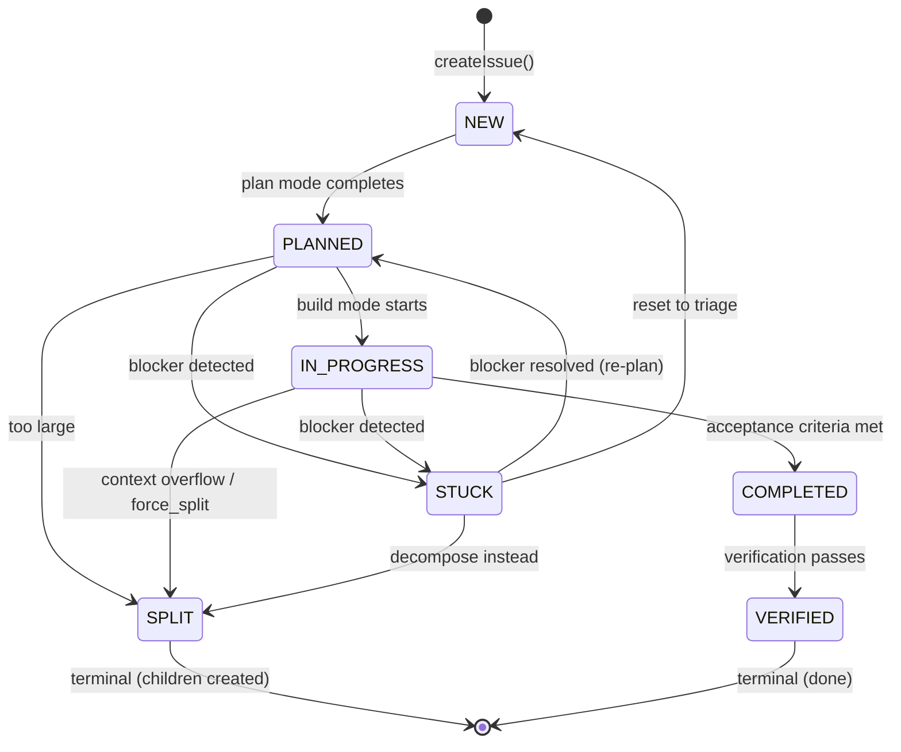
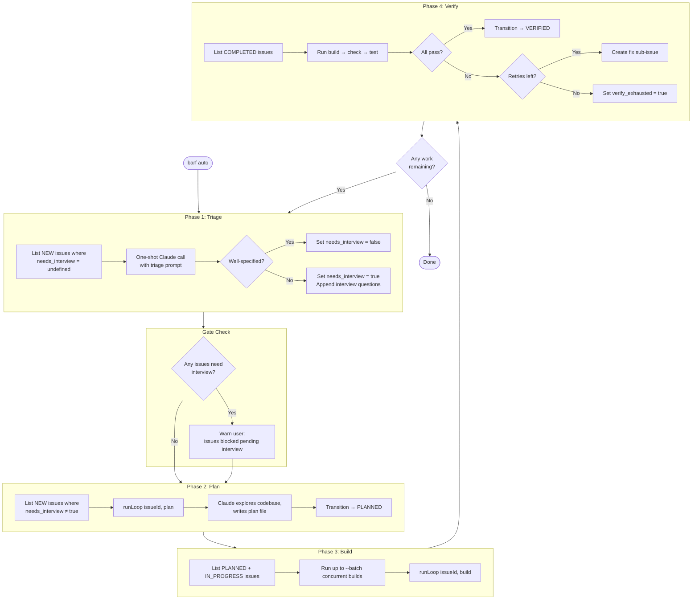
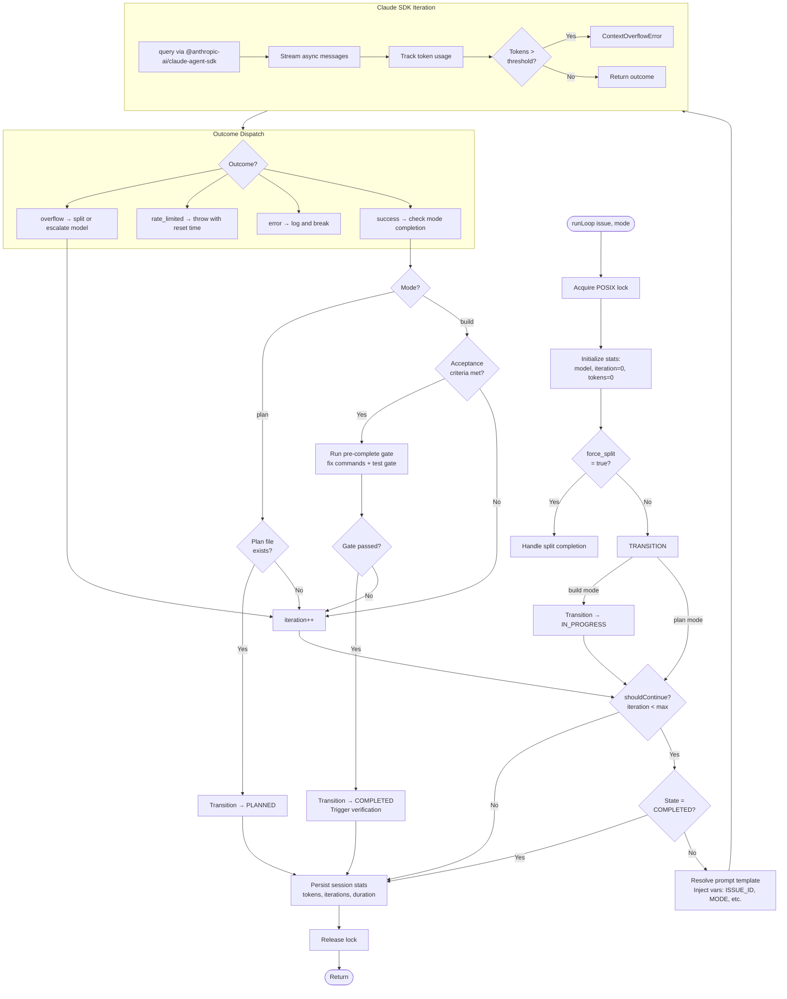
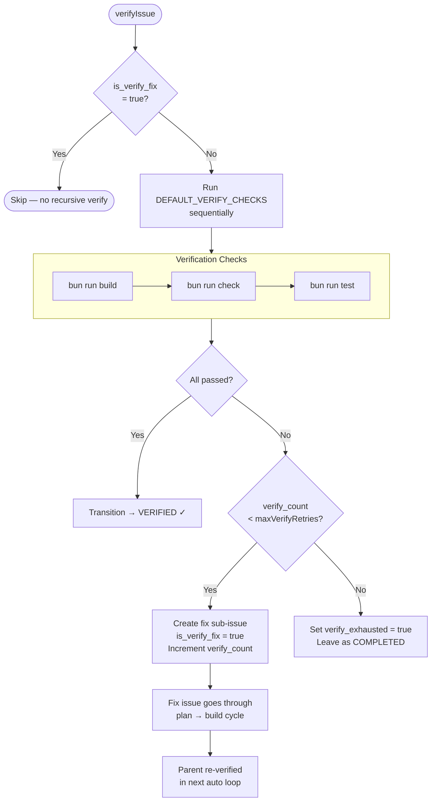
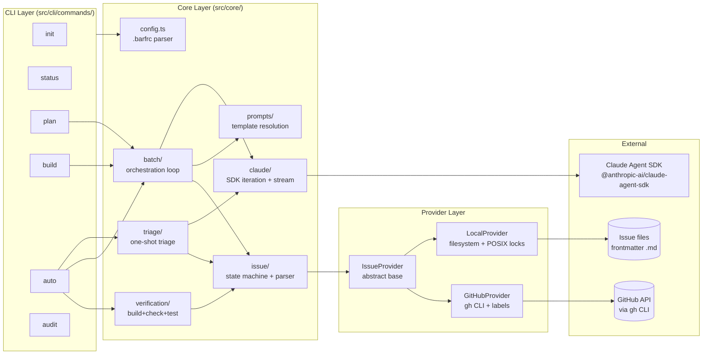
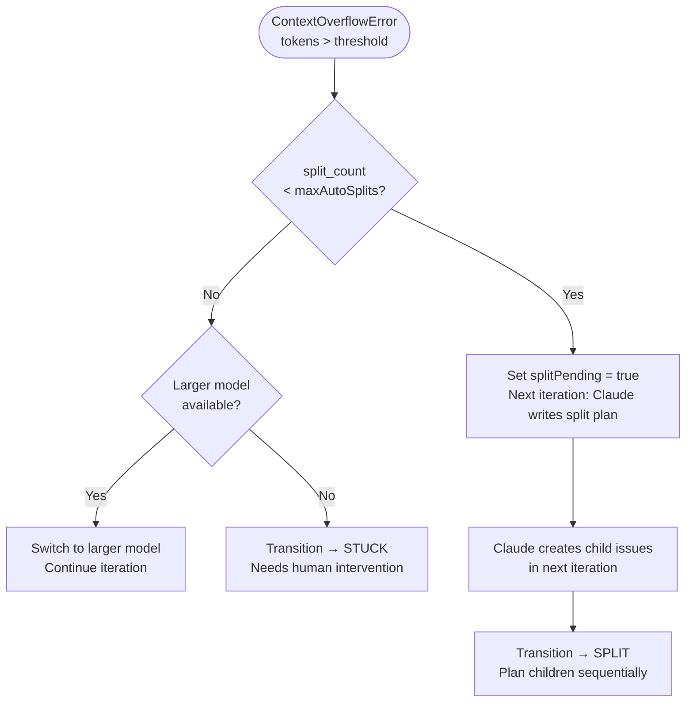
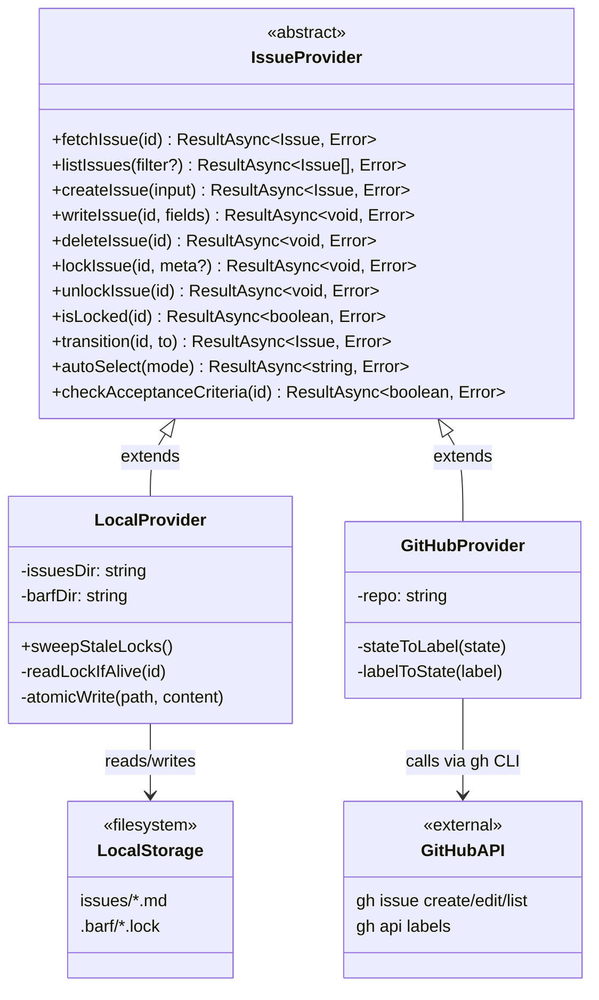

# barf-ts Architecture Diagrams

## Issue State Machine

The core state machine governs all issue lifecycle transitions. States are validated by `VALID_TRANSITIONS` in `src/core/issue/index.ts` — direct state mutation is never permitted.

## Auto Command Pipeline

The `auto` command runs a continuous loop through four phases until no work remains. This is the primary orchestration entry point for hands-off operation.

## Build Loop (Single Issue)

The core iteration loop in `src/core/batch/loop.ts` drives a single issue through Claude interactions until completion or exhaustion.

## Verification Flow

After an issue reaches COMPLETED, verification runs build/check/test commands. Failed verification spawns fix sub-issues up to a retry limit.

## Data Flow Overview

Three-layer architecture: CLI → Core → Providers. All I/O goes through providers; core logic is pure.

## Context Overflow Handling

When Claude's token usage exceeds the configured threshold, barf decides whether to split the issue or escalate to a larger model.

## Provider Architecture

The provider abstraction enables swapping between local filesystem and GitHub Issues storage with identical semantics.

