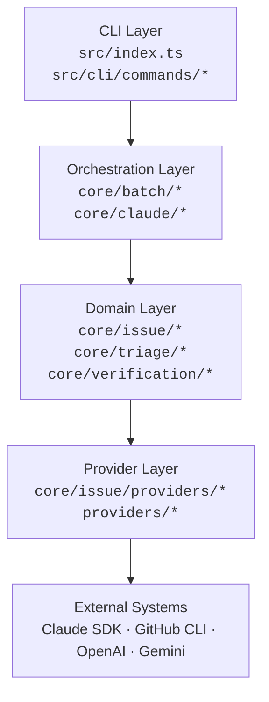
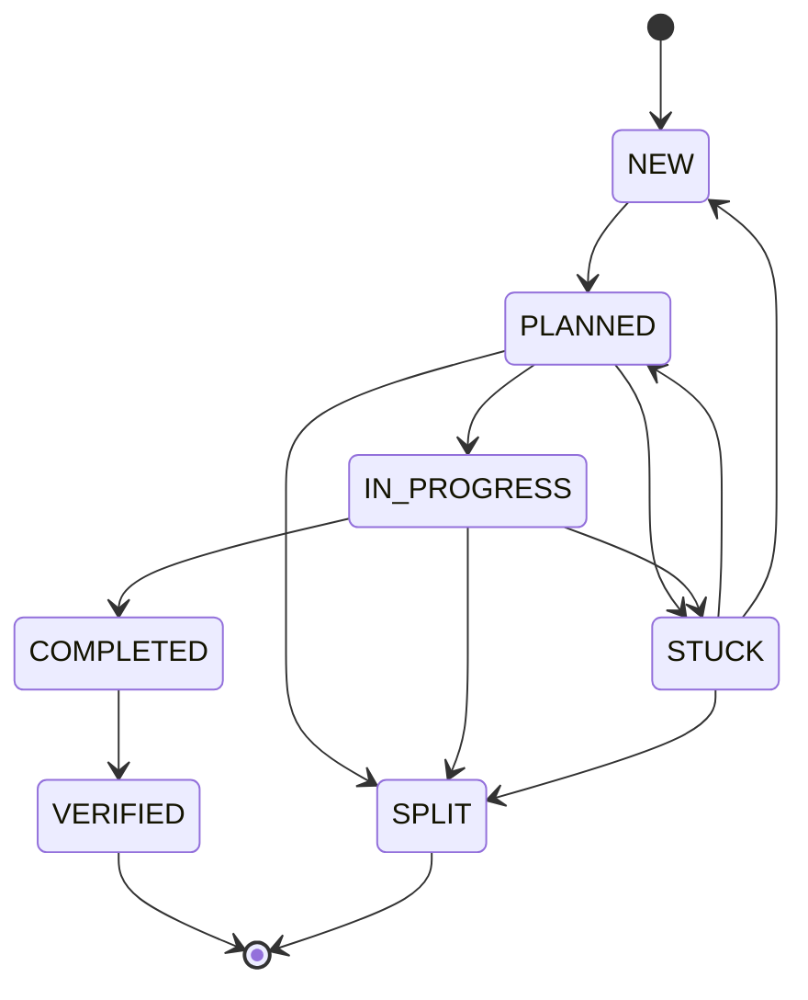

# barf Architecture

AI issue orchestration CLI — feeds issues to Claude one at a time, tracks state through a lifecycle, and handles context overflow automatically. This document is the entry point for both the generated API docs and human readers.

## System Overview

barf manages a queue of issues (markdown files or GitHub Issues), each with a state machine governing its lifecycle. The CLI dispatches Claude agent SDK sessions to plan, build, and verify each issue. When Claude's context window fills up, barf either splits the issue into smaller pieces or escalates to a larger model.

## Layer Diagram



**CLI Layer** — Parses arguments (commander), loads config, creates the issue provider, and delegates to command functions. Thin handlers that own `process.exitCode` and nothing else.

**Orchestration Layer** — The `runLoop` function drives Claude iterations on an issue until completion or overflow. `core/claude/*` manages SDK queries, stream consumption, token tracking, and display. `core/batch/*` handles the loop state machine, outcome branching, and stats persistence.

**Domain Layer** — Issue parsing/serialization, the state machine (`VALID_TRANSITIONS`), triage evaluation, and post-completion verification. Pure business logic with no I/O dependencies.

**Provider Layer** — Pluggable backends for issue storage (`LocalIssueProvider`, `GitHubIssueProvider`) and audit reviews (`OpenAIAuditProvider`, `GeminiAuditProvider`, `ClaudeAuditProvider`, `CodexAuditProvider`).

## Data Flow: `barf plan 001`

```
1. CLI parses args → loadConfig() → createIssueProvider()
2. planCommand() calls runLoop("001", "plan", config, provider)
3. runLoop:
   a. provider.fetchIssue("001") → Issue { state: NEW }
   b. validateTransition(NEW → IN_PROGRESS) ✓
   c. provider.lockIssue("001")
   d. resolvePromptTemplate("plan", issue, config) → prompt string
   e. runClaudeIteration(prompt, config) → SDK Query
   f. consumeSDKQuery() streams messages, tracks tokens
   g. If tokens > threshold → ContextOverflowError → split or escalate
   h. On success: issue.state = PLANNED
   i. provider.updateIssue(issue) + provider.unlockIssue("001")
4. CLI exits with code 0
```

## Issue State Machine



| State | Meaning |
|-------|---------|
| `NEW` | Created, awaiting triage |
| `PLANNED` | Plan file exists, ready to build |
| `IN_PROGRESS` | Claude is actively working |
| `STUCK` | Blocked — needs human help or re-planning |
| `SPLIT` | Decomposed into child issues (terminal) |
| `COMPLETED` | Acceptance criteria met; awaiting verification |
| `VERIFIED` | Build + lint + tests pass (terminal) |

Transitions are enforced by `validateTransition()` in `core/issue/index.ts` against the `VALID_TRANSITIONS` map. Direct state mutation is never allowed.

## Key Abstractions

### IssueProvider (`core/issue/base.ts`)

Abstract class defining the contract for issue storage. Methods: `listIssues`, `fetchIssue`, `updateIssue`, `createIssue`, `lockIssue`, `unlockIssue`. Two implementations:

- **`LocalIssueProvider`** — Markdown files on disk with POSIX `mkdir`-based locking
- **`GitHubIssueProvider`** — GitHub Issues via `gh` CLI, labels for state, `barf:locked` label for locking

### AuditProvider (`providers/base.ts`)

Abstract class for AI-powered code review. Methods: `audit(issueBody, diff, rules)`. Implementations wrap OpenAI, Gemini, Claude, and Codex (OpenAI responses API) APIs.

### Config (`core/config.ts`)

Parsed from `.barfrc` (KEY=VALUE format). Validated with Zod schemas. All operational values (models, thresholds, directories) flow through this single config object.

### Prompt Templates (`core/prompts.ts`)

Runtime resolution of mode-specific prompts (`plan`, `build`, `split`, `audit`, `triage`). Checks `PROMPT_DIR` for custom overrides, falls back to compiled-in `.md` templates.

## "Where Do I Look?" Table

| Task | Entry point |
|------|-------------|
| Add a CLI command | `src/cli/commands/` — see [Adding a Command](guides/adding-a-command.md) |
| Add an audit provider | `src/providers/` — see [Adding an Audit Provider](guides/adding-an-audit-provider.md) |
| Change state transitions | `src/core/issue/index.ts` → `VALID_TRANSITIONS` |
| Modify Claude interaction | `src/core/claude/iteration.ts` (setup), `stream.ts` (consumption) |
| Change orchestration loop | `src/core/batch/loop.ts` (main loop), `outcomes.ts` (outcome handlers) |
| Add a config option | `src/types/schema/config-schema.ts` → `ConfigSchema`, then `src/core/config.ts` |
| Modify issue format | `src/types/schema/issue-schema.ts` → `IssueSchema`, then `src/core/issue/index.ts` |
| Change verification checks | `src/core/verification/checks.ts` |
| Modify triage behavior | `src/core/triage/triage.ts` |
| Edit prompt templates | `src/prompts/PROMPT_*.md` |

## Module Map

The API docs are organized by these logical modules (set via `@module` tags):

| Module | What it covers |
|--------|---------------|
| **Issue Model** | Parsing, serialization, state machine, transitions |
| **Issue Providers** | Local filesystem and GitHub issue backends |
| **Orchestration** | Batch loop, Claude SDK integration, context management, prompts |
| **Verification** | Post-completion checks (build/lint/test) and fix-issue creation |
| **Triage** | One-shot evaluation of NEW issues for interview needs |
| **CLI Commands** | `init`, `status`, `plan`, `build`, `auto`, `audit` |
| **Audit Providers** | OpenAI, Gemini, Claude, Codex audit backends |
| **Configuration** | Config loading, Zod schemas, type definitions, error classes |
| **Utilities** | Logger, subprocess helpers, error coercion |
