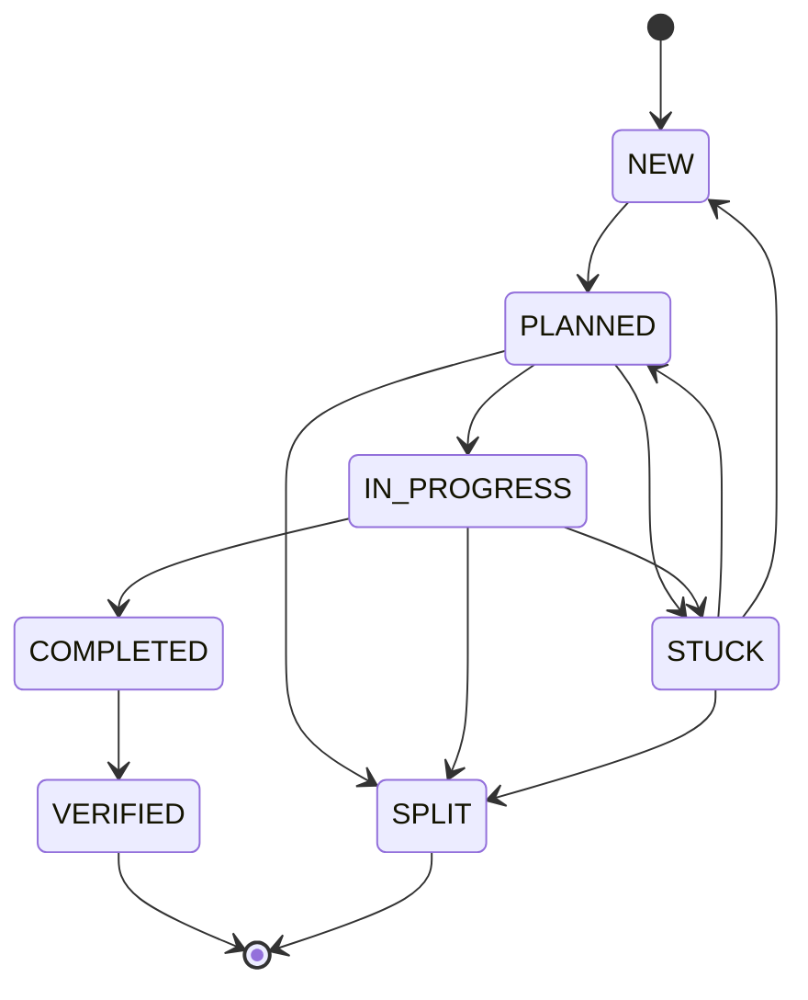

# Issue Lifecycle

Deep dive on the barf issue state machine, transitions, and how the orchestration loop drives issues through their lifecycle.

## State Machine



## States

| State | Meaning | Terminal? |
|-------|---------|-----------|
| `NEW` | Created, awaiting triage | No |
| `PLANNED` | Plan file exists, ready to build | No |
| `IN_PROGRESS` | Claude is actively working | No |
| `STUCK` | Blocked — needs human help or re-planning | No |
| `SPLIT` | Decomposed into child issues | Yes |
| `COMPLETED` | All acceptance criteria met; awaiting verification | No |
| `VERIFIED` | Build + lint + tests pass | Yes |

## The `VALID_TRANSITIONS` Map

Defined in `src/core/issue/index.ts`:

```typescript
export const VALID_TRANSITIONS: Record<IssueState, IssueState[]> = {
  NEW: ['PLANNED'],
  PLANNED: ['IN_PROGRESS', 'STUCK', 'SPLIT'],
  IN_PROGRESS: ['COMPLETED', 'STUCK', 'SPLIT'],
  STUCK: ['PLANNED', 'NEW', 'SPLIT'],
  SPLIT: [],          // terminal
  COMPLETED: ['VERIFIED'],
  VERIFIED: [],       // terminal
}
```

Terminal states (`SPLIT`, `VERIFIED`) have empty arrays — no further transitions.

## Transition Enforcement

**Never mutate `issue.state` directly.** Always use:

```typescript
import { validateTransition } from '@/core/issue'

const result = validateTransition(issue, 'PLANNED')
// result: ok(issue) with updated state, or err(InvalidTransitionError)
```

`validateTransition` checks the current state against `VALID_TRANSITIONS` and returns a `Result`. The `IssueProvider` implementations call this internally before persisting.

## How `barf auto` Drives the Lifecycle

The `autoCommand` runs a continuous loop:

```
while (actionable issues exist) {
  1. TRIAGE — For each NEW issue with needs_interview=undefined:
     → One-shot Claude call evaluates clarity
     → Sets needs_interview=true (needs refinement) or false (ready)

  2. GATE CHECK — Warn about issues with needs_interview=true
     → User must run /barf-interview before these can be planned

  3. PLAN — For each NEW issue with needs_interview=false:
     → runLoop(issueId, "plan") → Claude writes plan file
     → NEW → PLANNED

  4. BUILD — For up to `batch` PLANNED/IN_PROGRESS issues:
     → runLoop(issueId, "build") → Claude implements plan
     → PLANNED → IN_PROGRESS → COMPLETED

  5. VERIFY — For each COMPLETED issue:
     → Run build/lint/test checks
     → All pass → COMPLETED → VERIFIED
     → Any fail → Create fix sub-issue → loop continues
}
```

## Context Overflow

During any Claude iteration, if token usage exceeds `CONTEXT_USAGE_PERCENT`:

1. **Split** (if `split_count < MAX_AUTO_SPLITS`): Claude decomposes the issue into child issues. Parent → `SPLIT`, children start as `NEW`.
2. **Escalate** (if splits exhausted): Switch to `EXTENDED_CONTEXT_MODEL` and retry with a larger context window.

This is handled by `handleOverflow` in `src/core/batch/outcomes.ts`.

## The `needs_interview` Flag

Separate from the state machine. Set during triage on `NEW` issues:

- `undefined` — Not yet triaged
- `false` — Triaged, requirements are clear, ready for planning
- `true` — Under-specified, needs clarification via `/barf-interview`

Issues with `needs_interview=true` are skipped by the plan phase. After the interview, `needs_interview` is set to `false` and the issue becomes plannable.

## Verification Flow

After an issue reaches `COMPLETED`:

1. `verifyIssue()` runs the checks defined in `DEFAULT_VERIFY_CHECKS` (build, lint, test)
2. **All pass** → `COMPLETED → VERIFIED` (terminal)
3. **Any fail** → A fix sub-issue is created as a child with `is_verify_fix=true`
4. The fix sub-issue goes through the normal `NEW → PLANNED → COMPLETED` cycle
5. When all fix children are done, the parent is re-verified
6. After `MAX_VERIFY_RETRIES` exhausted → `verify_exhausted=true`, left as `COMPLETED`

See `src/core/verification/` for the implementation.

## Issue Format

Issues are markdown files with frontmatter:

```markdown
---
id=001
title=Add user authentication
state=NEW
parent=
children=
split_count=0
needs_interview=false
---

Implement JWT-based authentication for the API.

## Acceptance Criteria

- [ ] POST /auth/login returns a signed JWT
- [ ] Middleware validates token on protected routes
```

The `parseIssue()` function in `src/core/issue/index.ts` parses this format. `serializeIssue()` writes it back. The `IssueSchema` Zod schema in `src/types/schema/issue-schema.ts` validates the parsed fields.
