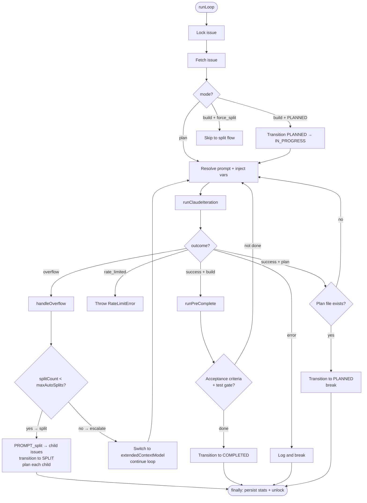
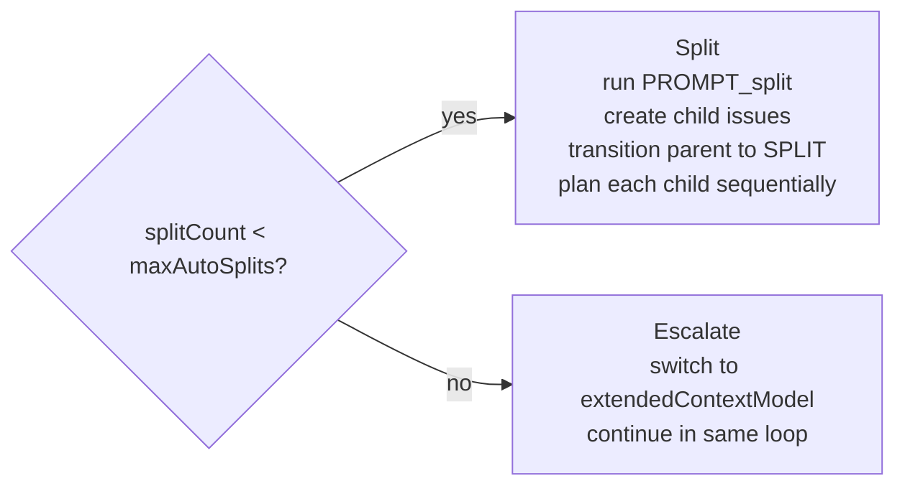

# Batch Orchestration Loop

**Source:** `src/core/batch/`

The batch loop is the heart of barf — it orchestrates how Claude works on an issue across multiple iterations, handles context overflow, and manages state transitions.

## Entry Point

```typescript
runLoop(issueId: string, mode: LoopMode, config: Config, provider: IssueProvider, deps?: RunLoopDeps)
// mode: 'plan' | 'build' | 'split'
// Returns ResultAsync<void, Error>
```

## High-Level Flow



## Iteration Cycle Detail

Each iteration:

1. Fetch current issue state (fresh read each time)
2. Break if issue is already `COMPLETED`
3. Resolve prompt template (`PROMPT_plan.md`, `PROMPT_build.md`, or `PROMPT_split.md`)
4. Apply per-issue `context_usage_percent` override if set
5. Inject template variables:
   - `$BARF_ISSUE_FILE` — absolute path to issue markdown
   - `$BARF_ISSUE_ID` — issue id
   - `$BARF_MODE` — current mode
   - `$BARF_ITERATION` — zero-based iteration number
   - `$ISSUES_DIR` — issues directory
   - `$PLAN_DIR` — plans directory
6. Call `runClaudeIteration(prompt, model, config, issueId, displayContext)`
7. Accumulate token stats
8. Dispatch outcome handler

## Overflow Decision

When context usage exceeds threshold (`contextUsagePercent`):



Controlled by `handleOverflow()` in `src/core/batch/helpers.ts`.

## Outcome Types

```typescript
type IterationOutcome =
  | 'success'       // Claude finished without interruption
  | 'overflow'      // context threshold exceeded mid-stream
  | 'rate_limited'  // API 429, includes resetsAt timestamp
  | 'error'         // abort, timeout, or unexpected failure
```

## Pre-Completion Gate (`src/core/pre-complete.ts`)

Runs before checking acceptance criteria in build mode:

```
1. fixCommands (best-effort, failures logged but don't block)
   e.g. "biome check --apply", "bun run format:fix"
2. testCommand (must pass — blocks completion if it fails)
   e.g. "bun test"
```

If test fails → continue building (don't transition to COMPLETED).

## Verification Gate (`src/core/verification/`)

Runs after `COMPLETED` transition (called by `barf auto`):

```
verifyIssue(issueId, config, provider)
├── skip if is_verify_fix=true (avoid recursive verification)
├── run DEFAULT_VERIFY_CHECKS:
│   ├── bun run build
│   ├── bun run check
│   └── bun test
└── all passed?
    ├── YES → transition COMPLETED → VERIFIED (terminal)
    └── NO  → create fix sub-issue (is_verify_fix=true)
              increment verify_count
              if verify_count >= maxVerifyRetries:
                set verify_exhausted=true
                leave as COMPLETED
```

## Session Stats

Accumulated per `runLoop` call and persisted to issue frontmatter:

| Field | Description |
|-------|-------------|
| `total_input_tokens` | Cumulative input tokens across all iterations |
| `total_output_tokens` | Cumulative output tokens |
| `total_duration_seconds` | Wall-clock time |
| `total_iterations` | Number of Claude SDK calls |
| `run_count` | Number of times runLoop was called for this issue |

A formatted stats block is also appended to the issue body after each session.

## Key Files

| File | Responsibility |
|------|---------------|
| `batch/loop.ts` | Main loop, locking, state transitions |
| `batch/outcomes.ts` | Outcome handler functions (split, overflow, plan, build) |
| `batch/helpers.ts` | `shouldContinue`, `handleOverflow`, `resolveIssueFile`, `planSplitChildren` |
| `batch/stats.ts` | SessionStats creation + persistence |
| `pre-complete.ts` | Fix commands + test gate |
| `verification/orchestration.ts` | Post-COMPLETED verify + fix loop |
| `verification/checks.ts` | `DEFAULT_VERIFY_CHECKS`, `runVerification()` |
| `verification/format.ts` | `buildFixBody()` — formats failure output for fix issues |
