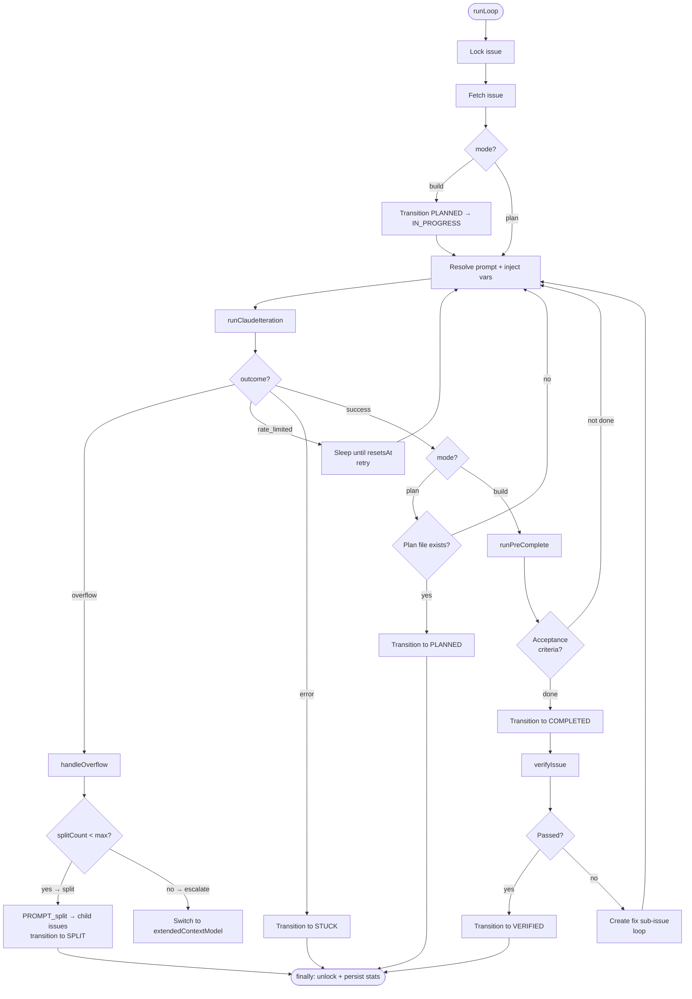
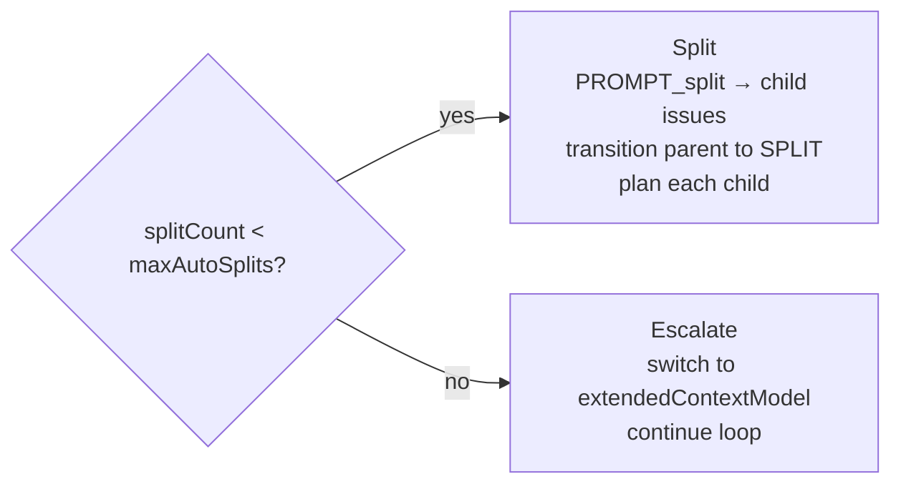

# Batch Orchestration Loop

**Source:** `src/core/batch/`

The batch loop is the heart of barf — it orchestrates how Claude works on an issue across multiple iterations, handles context overflow, and manages state transitions.

## Entry Point

```typescript
runLoop(issueId, mode, config, provider)
// mode: 'plan' | 'build'
```

## High-Level Flow



## Iteration Cycle Detail

```
1. fetch current issue state
2. resolve prompt (PROMPT_plan.md or PROMPT_build.md)
3. inject template variables:
   BARF_ISSUE_FILE     path to issue markdown file
   BARF_ISSUE_ID       issue id (e.g. ISS-001)
   BARF_PLAN_FILE      path to plan file (build mode)
   BARF_ISSUES_DIR     directory of all issues
   BARF_PROJECT_ROOT   project root directory
4. call runClaudeIteration(prompt, config, issueId, iterationNum)
5. receive IterationResult { outcome, tokens, contextPercent, duration }
6. accumulate stats
7. dispatch outcome handler
```

## Overflow Decision

When context usage exceeds threshold (`contextUsagePercent`):



Controlled by `handleOverflow` in `src/core/batch/helpers.ts` and `handleOverflow` outcome handler in `src/core/batch/outcomes.ts`.

## Outcome Types

```typescript
type IterationOutcome =
  | 'success'       // Claude finished without interruption
  | 'overflow'      // context threshold exceeded
  | 'rate_limited'  // API 429, includes resetsAt timestamp
  | 'error'         // abort, timeout, or unexpected failure
```

## Pre-Completion Gate (`src/core/pre-complete.ts`)

Runs before checking acceptance criteria:

```
1. fixCommands (best-effort, don't block on failure)
   e.g. "bun run lint --fix", "bun run format"
2. testCommand (must pass, blocks completion if it fails)
   e.g. "bun test"
```

If test fails → continue building (don't transition to COMPLETED).

## Verification Gate (`src/core/verification/`)

Runs after COMPLETED transition:

```
verifyIssue
├── run build check:  bun run build
├── run type check:   bun run check
├── run tests:        bun test
└── all passed?
    ├── YES → transition COMPLETED → VERIFIED
    └── NO  → create child fix issue (PLANNED)
              loop up to maxVerifyAttempts
              if still failing → mark STUCK
```

## Session Stats

Accumulated per `runLoop` call and persisted to issue frontmatter:

```
total_input_tokens       cumulative input tokens across all iterations
total_output_tokens      cumulative output tokens
total_duration_seconds   wall time
total_iterations         number of Claude calls
run_count                number of times runLoop was called for this issue
```

## Key Files

| File | Responsibility |
|------|---------------|
| `batch/loop.ts` | Main loop, locking, state transitions |
| `batch/outcomes.ts` | Outcome handler functions |
| `batch/helpers.ts` | shouldContinue, handleOverflow decision |
| `batch/stats.ts` | SessionStats accumulation + persistence |
| `pre-complete.ts` | fix commands + test gate |
| `verification/orchestration.ts` | post-COMPLETED verify + fix loop |
| `verification/checks.ts` | individual build/check/test runners |
