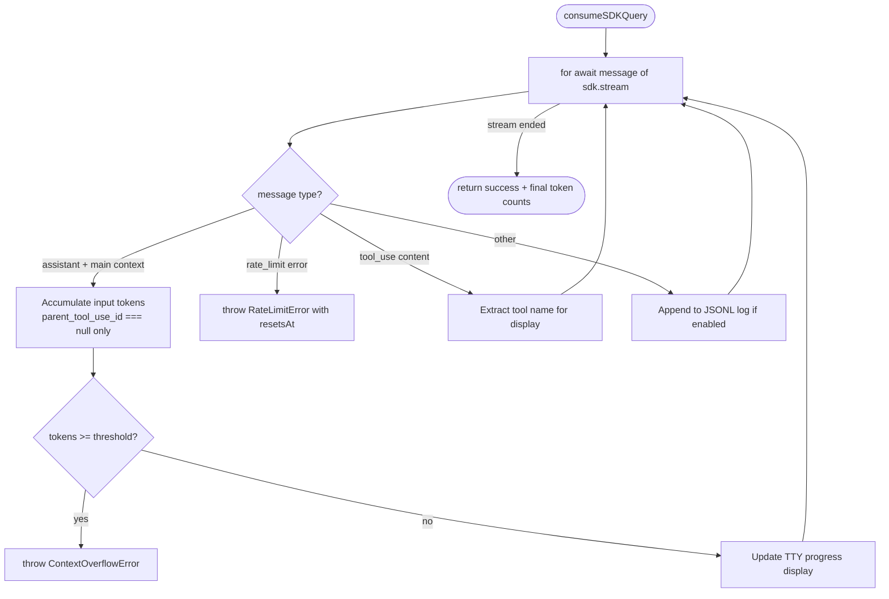

# Claude AI Integration

**Source:** `src/core/claude/`

barf uses `@anthropic-ai/claude-agent-sdk` directly for main orchestration (plan/build/split). Triage uses the `claude` CLI subprocess for one-shot calls. Each issue iteration is a single SDK query with streaming.

## Components

```
claude/
  iteration.ts    runClaudeIteration — entry point per iteration
  stream.ts       consumeSDKQuery — async stream consumption + token tracking
  context.ts      MODEL_CONTEXT_LIMITS, getThreshold(), context limit registry
  display.ts      TTY progress rendering (sticky header, context %)
```

## Iteration Flow

```typescript
runClaudeIteration(prompt, model, config, issueId?, displayContext?)
// Returns ResultAsync<IterationResult, Error>
```

```
1. Compute token threshold = getContextLimit(model) × contextUsagePercent / 100
2. Create AbortController with claudeTimeout
3. Open JSONL stream log file (if DISABLE_LOG_STREAM not set)
4. Create SDK query with:
   - permissionMode: 'bypassPermissions'
   - settingSources: []  (no CLAUDE.md loaded by SDK)
   - CLAUDE_AUTOCOMPACT_PCT_OVERRIDE: '100'  (disable auto-compact)
5. Call consumeSDKQuery(query, threshold, abortSignal, logStream)
6. Return IterationResult { outcome, tokens, outputTokens, rateLimitResetsAt? }
```

## Stream Consumer (`stream.ts`)



Key design: token tracking only counts **main-context assistant messages** (`parent_tool_use_id === null`), not sub-agent turns. This accurately reflects how much of the context window is consumed.

## Context Management (`context.ts`)

```typescript
// Default context limit for unknown models
const DEFAULT_CONTEXT_LIMIT = 200_000

// Mutable registry — model → token limit
const MODEL_CONTEXT_LIMITS: Map<string, number>
// Pre-registered: claude-opus-4-6, claude-sonnet-4-6, claude-haiku-4-5-20251001

// Get limit for a model (falls back to DEFAULT_CONTEXT_LIMIT)
getContextLimit(model: string): number

// Compute interrupt threshold
getThreshold(model: string, contextUsagePercent: number): number
// e.g. claude-sonnet-4-6 @ 75% → floor(0.75 × 200,000) = 150,000 tokens

// Register custom model limit at runtime (for tests)
setContextLimit(model: string, limit: number): void
```

Context limit is checked **during streaming** — barf interrupts the iteration as soon as the threshold is crossed, rather than waiting for Claude to finish. This gives the loop a chance to split before the context is completely exhausted.

## Error Types

| Error | Trigger | Outcome |
|-------|---------|---------|
| `ContextOverflowError` | Tokens >= threshold during streaming | Caught → `'overflow'` outcome |
| `RateLimitError` | API 429 during streaming | Caught → `'rate_limited'` outcome |
| AbortSignal timeout | `claudeTimeout` exceeded | Caught → `'error'` outcome |

## TTY Display (`display.ts`)

Writes a 2-line sticky header to stderr when attached to a terminal:

```
▶ build  001  IN_PROGRESS  Add user authentication
[  ▓▓▓▓▓▓▓░░░░░░░░░░  125,000 / 200,000 tokens (62%) - tool_use: Bash ]
```

- Line 1: Mode, issue ID, state, title (truncated to 50 chars)
- Line 2: Progress bar, token count / threshold, current tool name
- Cleared on completion

## Prompt Template System (`src/core/prompts.ts`)

Prompts are markdown files embedded at compile time via Bun import attributes:

```typescript
import planPrompt from './prompts/PROMPT_plan.md' with { type: 'text' };
```

Template variables are injected via `injectTemplateVars()` — simple `$KEY` / `${KEY}` string replacement (no eval, no shell injection):

| Variable | Description |
|----------|-------------|
| `$BARF_ISSUE_FILE` | Absolute path to issue markdown |
| `$BARF_ISSUE_ID` | Issue identifier |
| `$BARF_MODE` | Current mode (plan/build/split) |
| `$BARF_ITERATION` | Zero-based iteration number |
| `$ISSUES_DIR` | Issues directory |
| `$PLAN_DIR` | Plans directory |

When `PROMPT_DIR` is configured, prompts are **re-read from disk per iteration**, allowing live editing during long runs. Missing files fall back to compiled-in defaults.

## Stream Logging

When `DISABLE_LOG_STREAM` is not set (default), raw SDK messages are appended per-issue:

```
.barf/streams/
  001.jsonl     ← one file per issue, all iterations appended
  002.jsonl
```

Each line is a raw SDK message as JSON. Useful for debugging Claude's reasoning and tool usage patterns. The dashboard's activity log also reads these files.

## Models

Each mode can use a different model (configured in `.barfrc`):

| Config Key | Default | Used For |
|-----------|---------|----------|
| `TRIAGE_MODEL` | `claude-haiku-4-5-20251001` | Triage evaluation (CLI subprocess) |
| `PLAN_MODEL` | `claude-opus-4-6` | Planning iterations (SDK) |
| `BUILD_MODEL` | `claude-sonnet-4-6` | Build iterations (SDK) |
| `SPLIT_MODEL` | `claude-sonnet-4-6` | Split child issue generation (SDK) |
| `EXTENDED_CONTEXT_MODEL` | `claude-opus-4-6` | Escalation after maxAutoSplits (SDK) |
