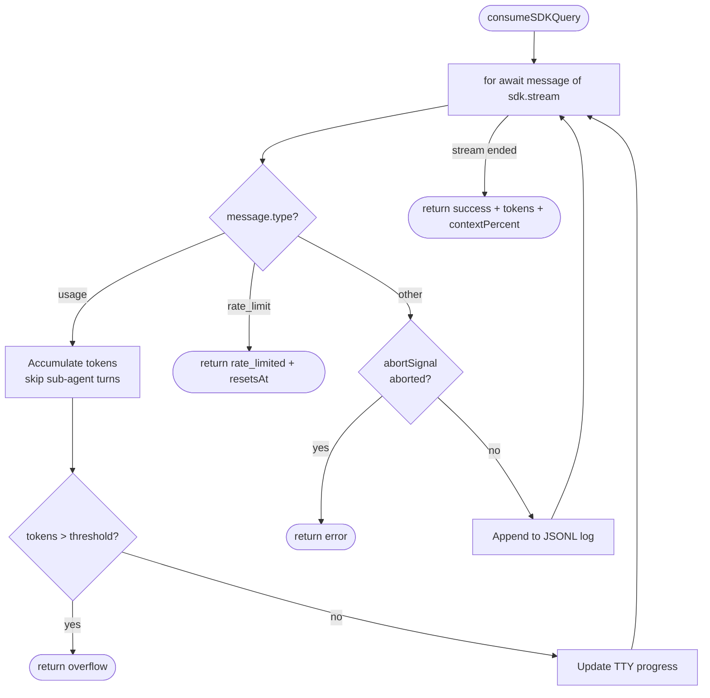

# Claude AI Integration

**Source:** `src/core/claude/`

barf uses `@anthropic-ai/claude-agent-sdk` directly (not the Claude CLI subprocess). Each issue iteration is a single SDK query with streaming.

## Components

```
claude/
  iteration.ts    runClaudeIteration — entry point per iteration
  stream.ts       consumeSDKQuery — async stream consumption + token tracking
  context.ts      context limits, overflow threshold, error types
  display.ts      TTY progress rendering
```

## Iteration Flow

```
runClaudeIteration(prompt, config, issueId, iterNum)
├── compute token threshold = contextLimit(model) × contextUsagePercent
├── create AbortController (claudeTimeout)
├── optionally open JSONL stream log file
├── call consumeSDKQuery(query, threshold, abortSignal, logStream)
└── return IterationResult { outcome, tokens, contextPercent, duration }
```

## Stream Consumer (`stream.ts`)



## Context Management (`context.ts`)

```typescript
// Context window sizes by model
getContextLimit(model: string): number

// Interrupt threshold
getThreshold(model, percent): number
// e.g. claude-sonnet-4-5 @ 75% → 0.75 × 200_000 = 150_000 tokens

// Errors (returned as outcomes, not thrown)
ContextOverflowError   // tokens exceeded threshold
RateLimitError         // API 429
```

Context limit is checked **during streaming** — barf interrupts the iteration as soon as the threshold is crossed, rather than waiting for Claude to finish. This gives the loop a chance to split before the context is completely exhausted.

## TTY Display (`display.ts`)

Writes to stderr when attached to a terminal:

```
[ISS-001] build | IN_PROGRESS — Add user authentication
  → Bash (47,230 / 150,000 tokens)
```

- Header: issueId, mode, state, title
- Progress line: current tool name + running token count / threshold
- Cleaned up on completion

## Prompt Template System (`src/core/prompts.ts`)

Prompts are markdown files embedded at compile time via Bun import attributes:

```typescript
import planPrompt from './prompts/PROMPT_plan.md' with { type: 'text' };
```

Template variables are injected via simple string replacement (not a template engine):

```
{BARF_ISSUE_FILE}    → absolute path to issue markdown
{BARF_ISSUE_ID}      → e.g. ISS-001
{BARF_PLAN_FILE}     → absolute path to plan file
{BARF_ISSUES_DIR}    → issues directory
{BARF_PROJECT_ROOT}  → project root
```

Prompts are **re-read from disk per iteration** when `promptDir` is configured, allowing live editing during long runs.

## Stream Logging

When `STREAM_LOG_DIR` is set in `.barfrc`:

```
.barf/streams/
  ISS-001.jsonl     ← one file per issue, all iterations appended
  ISS-002.jsonl
```

Each line is a raw SDK message as JSON. Useful for debugging Claude's reasoning and tool usage patterns.

## Models

Each mode can use a different model (configured in `.barfrc`):

| Config Key | Default Use |
|-----------|-------------|
| `triageModel` | triage evaluation |
| `planModel` | planning iteration |
| `buildModel` | build iterations |
| `splitModel` | generating split child issues |
| `extendedContextModel` | after maxAutoSplits exhausted |
| `auditModel` | audit evaluation |
