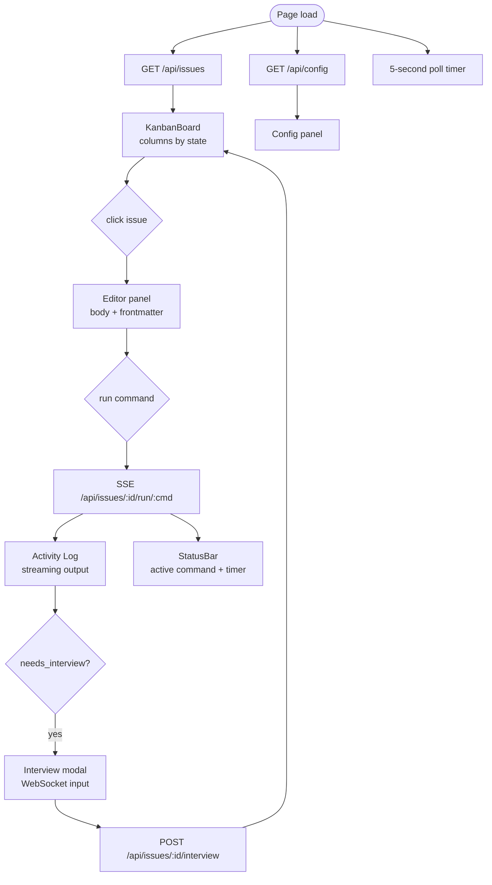
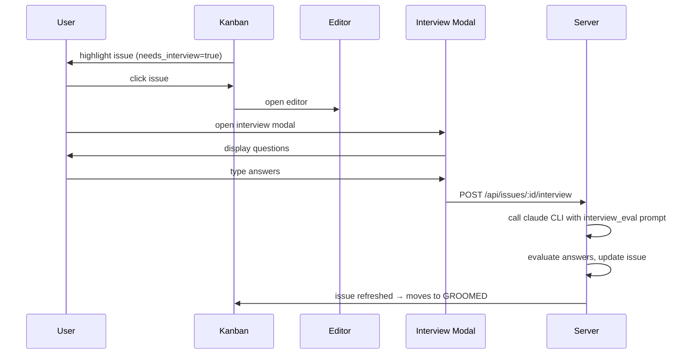

# Dashboard

**Source:** `tools/dashboard/`

The dashboard is a Bun HTTP server with a Preact frontend. It provides a visual interface for managing issues, monitoring runs, and interacting with the interview flow.

## Architecture

```
tools/dashboard/
  server.ts                   Bun.serve entry point (port 3333, idleTimeout 255)
  build.ts                    Bun bundler + Tailwind CLI v4
  routes/
    api.ts                    REST endpoints (issue CRUD, config, transitions, interview)
    sse.ts                    SSE streaming (command output, log tailing)
    ws.ts                     WebSocket for interactive interview subprocess
  services/
    issue-service.ts          DI container (wraps IssueProvider + Config)
    log-reader.ts             JSONL tail with byte-offset tracking
    activity-aggregator.ts    SDK message → ActivityEntry parser
  frontend/
    main.tsx                  Entry: render KanbanBoard + StatusBar
    lib/
      state.ts               @preact/signals (issues, selectedId, runningId, etc.)
      actions.ts             Business logic, SSE/WS singletons, immutable updates
      api-client.ts          Typed fetch wrappers for REST endpoints
      sse-client.ts          EventSource listener (command streaming)
      ws-client.ts           WebSocket client (interview)
      constants.ts           STATE_COLORS, STATE_LABELS, STATE_ORDER, CMD_ACTIONS
      types.ts               TypeScript interfaces
      format.ts              UI formatters (dates, tokens, etc.)
      issue-helpers.ts       Issue state/metadata helpers
      dom.ts                 DOM query/manipulation utilities
      resizer.ts             Drag-to-resize panel handler
    components/              Preact components (KanbanBoard, StatusBar, etc.)
    styles/                  Tailwind CSS source
```

## REST API (`routes/api.ts`)

```
GET    /api/issues              list all issues
POST   /api/issues              create issue { title, body }
GET    /api/issues/:id          get single issue
PUT    /api/issues/:id          update issue (title, body, frontmatter fields)
DELETE /api/issues/:id          delete issue
PUT    /api/issues/:id/transition   transition state { state }
POST   /api/issues/:id/interview    process interview Q&A, evaluate, update issue
GET    /api/config              get parsed config (API keys masked)
PUT    /api/config              save config to .barfrc (preserves comments + unknown keys)
```

## SSE Command Streaming (`routes/sse.ts`)

Run barf commands and stream output to the frontend:

```
GET|POST /api/auto              spawn "barf auto", stream stdout/stderr as SSE
POST     /api/auto/stop         kill active process
GET|POST /api/issues/:id/run/:cmd   run single command (plan/build/audit/triage) on issue
GET      /api/issues/:id/logs       SSE tail of .barf/streams/{id}.jsonl (polls 500ms)
GET      /api/issues/:id/logs/history   full JSONL history as JSON array
```

SSE event format:
```
data: {"type": "stdout|stderr|error|done", "line": "...", "exitCode": 0}
```

ANSI color codes are stripped from output before sending.

## WebSocket Interview (`routes/ws.ts`)

```
GET /api/issues/:id/run/interview   (with upgrade: websocket)
```

Spawns `barf interview --issue {id}` subprocess, pipes stdin/stdout/stderr over WebSocket. Active processes tracked in `wsProcs` Map for cleanup on disconnect.

## Frontend Architecture

### Signals (reactive state)

| Signal | Type | Description |
|--------|------|-------------|
| `issues` | `Issue[]` | Full issue list, refreshed every 5s + after commands |
| `selectedId` | `string?` | Currently-open issue in editor |
| `runningId` | `string?` | Issue with active command, or `'__auto__'` |
| `pauseRefresh` | `boolean` | Suppress polling during SSE streaming |
| `models` | `Record` | Model config from `.barfrc` |
| `activeCommand` | `string?` | Label for status bar (e.g. `"build #42"`) |
| `activityEntries` | `Entry[]` | Ordered activity log for session |

### Data Flow



### Key Frontend Patterns

- **Signals auto-subscribe** Preact components — only re-render when dependent signals change
- **Immutable updates**: `issues.value = issues.value.map(i => i.id===id ? {...i,...updates} : i)`
- **SSE/WS managed at module level** in `lib/actions.ts` (singletons)
- **`htm/preact` tagged templates** — no JSX compilation needed, no build config
- **DaisyUI + Tailwind** for styling — responsive, dark-mode compatible

## Interview Flow (Dashboard)



## Running the Dashboard

```bash
bun run dashboard          # build frontend + start server on port 3333
bun run dashboard:build    # build frontend only (to dist/)
```

The dashboard reads the same `.barfrc` config as the CLI — it operates on the same issue provider and configuration. The `--cwd`, `--config`, and `--port` CLI args are supported.

## Build Process (`build.ts`)

1. Bundle TypeScript: `tools/dashboard/frontend/main.tsx` → `dist/main.js` (minified + sourcemap)
2. Build CSS: Tailwind CLI v4 processes `frontend/styles/index.css` → `dist/styles.css` (minified)
3. Copy HTML: rewrites asset paths for dist directory
