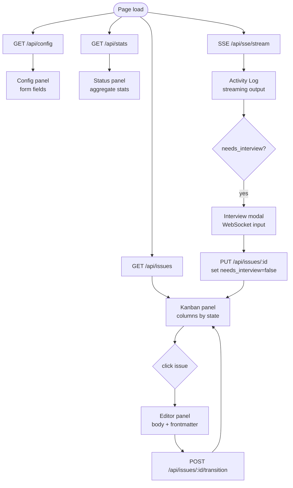
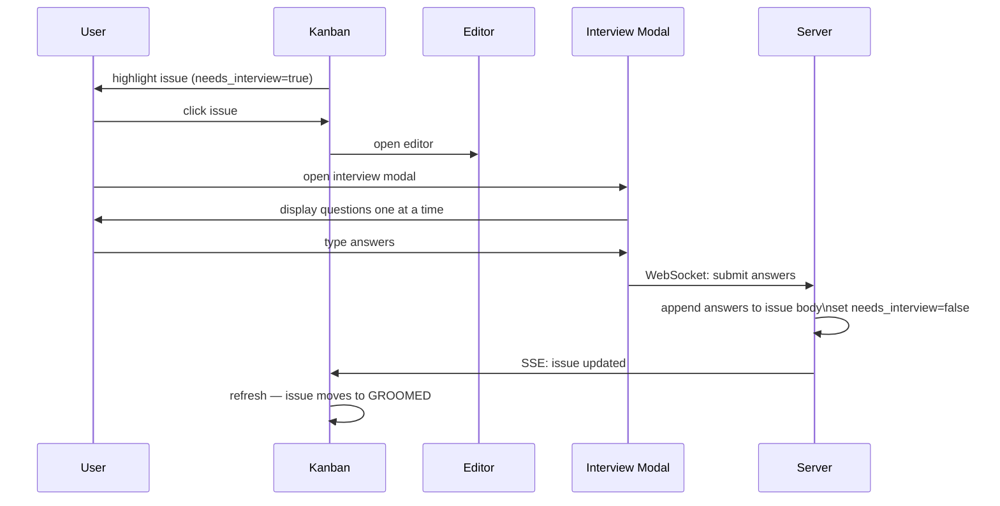

# Dashboard

**Source:** `tools/dashboard/`

The dashboard is a Bun HTTP server with a Vanilla TypeScript frontend. It provides a visual interface for managing issues, monitoring runs, and interacting with the interview flow.

## Architecture

```
tools/dashboard/
  server.ts                 Bun.serve entry point
  routes/
    api.ts                  REST endpoints (issue CRUD, config, transitions)
    sse.ts                  Server-Sent Events (stream log tailing)
  services/
    issue-service.ts        wraps IssueProvider + Config for HTTP layer
    log-reader.ts           parse .barf/streams/*.jsonl files
    activity-aggregator.ts  merge events from multiple sources
  frontend/
    main.ts                 boot: mount panels, init WebSocket/SSE clients
    panels/
      kanban.ts             issues grouped by state columns
      status.ts             summary stats + active command display
      editor.ts             issue detail view (title, body, state, transitions)
      config.ts             view/edit .barfrc configuration
      activity-log.ts       streaming output, interview terminal
      interview-modal.ts    interactive interview UI
    api-client.ts           typed fetch wrappers for REST endpoints
    sse-client.ts           SSE connection + event routing
    ws-client.ts            WebSocket for interview input
```

## REST API (`routes/api.ts`)

```
GET  /api/issues              list all issues
GET  /api/issues/:id          get single issue
POST /api/issues              create issue
PUT  /api/issues/:id          update issue (body, frontmatter fields)
DEL  /api/issues/:id          delete issue
POST /api/issues/:id/transition  transition state
GET  /api/config              get parsed config
PUT  /api/config              write .barfrc
GET  /api/stats               aggregate stats (counts by state, token totals)
```

## SSE Streaming (`routes/sse.ts`)

Real-time log streaming to the frontend via Server-Sent Events:

```
GET /api/sse/stream?issueId=ISS-001

Server streams events:
  data: {"type": "log", "issueId": "ISS-001", "content": "..."}
  data: {"type": "tool_use", "name": "Bash", "input": "..."}
  data: {"type": "complete", "outcome": "success"}
  data: {"type": "heartbeat"}
```

The SSE endpoint tails `.barf/streams/<issueId>.jsonl` (written by `consumeSDKQuery` when `STREAM_LOG_DIR` is set) and forwards parsed events to the browser.

## Frontend Data Flow



## Interview Flow (Dashboard)



## Running the Dashboard

```bash
bun run tools/dashboard/server.ts
# or
barf dashboard  # (if CLI command exists)
```

Dashboard reads the same `.barfrc` config as the CLI — it operates on the same issue provider and config.
