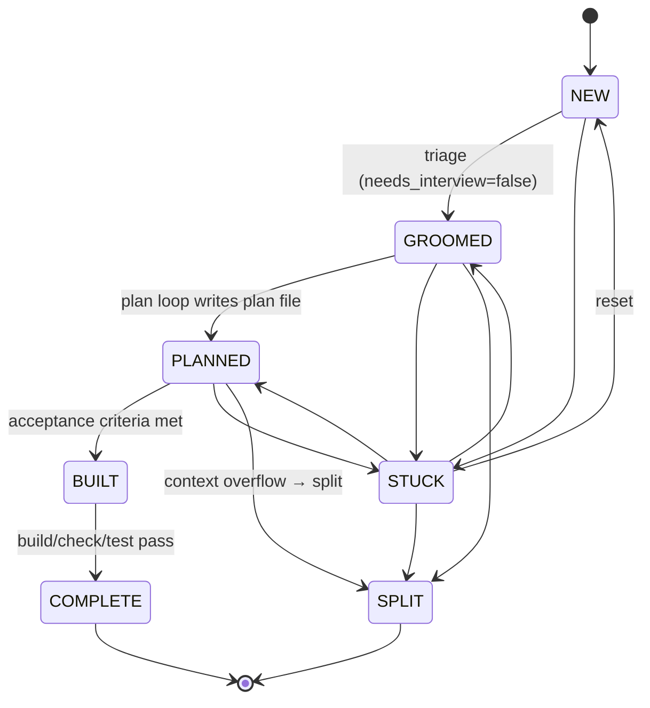

# Issue State Machine

**Source:** `src/types/schema/issue-schema.ts` (VALID_TRANSITIONS), `src/core/issue/index.ts` (parser, serializer, validator)

Issues are markdown files with `KEY=VALUE` frontmatter. State is a field in frontmatter. All transitions are validated — never mutate `issue.state` directly; always use `validateTransition()`.

## States

```
NEW          Fresh issue, not yet triaged
GROOMED      Triaged, needs_interview resolved (ready to plan)
PLANNED      Plan file exists in planDir (stays PLANNED while building)
BUILT        Acceptance criteria passed, pre-complete gate passed
COMPLETE     Build/check/test passed post-build (true terminal)
STUCK        Blocked — needs human intervention
SPLIT        Was too large; split into child issues (terminal)
```

## Issue Lifecycle Diagram



## Valid Transitions Map

```typescript
const VALID_TRANSITIONS = {
  NEW:         ['GROOMED', 'STUCK'],
  GROOMED:     ['PLANNED', 'STUCK', 'SPLIT'],
  PLANNED:     ['BUILT', 'STUCK', 'SPLIT'],
  BUILT:       ['COMPLETE'],
  STUCK:       ['PLANNED', 'NEW', 'GROOMED', 'SPLIT'],
  SPLIT:       [],          // terminal
  COMPLETE:    [],          // terminal
}
```

## Frontmatter Fields

```markdown
---
id=001
title=Add user authentication
state=PLANNED
parent=
children=
split_count=0
force_split=false
context_usage_percent=75
needs_interview=false
verify_count=0
is_verify_fix=false
verify_exhausted=false
total_input_tokens=125000
total_output_tokens=8500
total_duration_seconds=42
total_iterations=3
run_count=1
---
```

| Field | Type | Default | Description |
|-------|------|---------|-------------|
| `id` | string | — | Unique issue identifier |
| `title` | string | — | Issue title/summary |
| `state` | IssueState | `NEW` | Current state in state machine |
| `parent` | string | `""` | Parent issue ID (for split children) |
| `children` | string[] | `[]` | Comma-separated child issue IDs |
| `split_count` | number | `0` | How many times this issue has been split |
| `force_split` | boolean | `false` | Skip build, enter split flow directly |
| `context_usage_percent` | number? | — | Per-issue override for context threshold (1–100) |
| `needs_interview` | boolean? | — | `undefined`=untriaged, `false`=ready, `true`=needs Q&A |
| `verify_count` | number | `0` | Number of verification attempts |
| `is_verify_fix` | boolean? | — | This issue was created to fix a verification failure |
| `verify_exhausted` | boolean? | — | `verify_count` exceeded `MAX_VERIFY_RETRIES` |
| `total_input_tokens` | number | `0` | Cumulative input tokens across all runs |
| `total_output_tokens` | number | `0` | Cumulative output tokens across all runs |
| `total_duration_seconds` | number | `0` | Cumulative wall-clock seconds |
| `total_iterations` | number | `0` | Total SDK iterations across all runs |
| `run_count` | number | `0` | Number of barf sessions for this issue |

## Key Functions

| Function | Purpose | Location |
|----------|---------|----------|
| `parseIssue(content)` | Frontmatter markdown → Issue | `core/issue/index.ts` |
| `serializeIssue(issue)` | Issue → frontmatter markdown | `core/issue/index.ts` |
| `validateTransition(from, to)` | Check transition is legal | `core/issue/index.ts` |
| `parseAcceptanceCriteria(body)` | Count `- [ ]` / `- [x]` checkboxes | `core/issue/index.ts` |

## Provider Operations

The `IssueProvider` base class (`core/issue/base.ts`) provides shared methods:

- `transition(issue, nextState)` — validate + write
- `autoSelect(mode)` — pick next actionable issue by state priority
- `checkAcceptanceCriteria(issue)` — parse body, check all boxes ticked

Abstract I/O methods (implemented by local/github providers):

```
readIssue(id)   writeIssue(issue)   deleteIssue(id)   createIssue(opts)
listIssues()    lockIssue(id)       unlockIssue(id)    isLocked(id)
initProject()
```

## Acceptance Criteria

Issues use GitHub-flavored checkbox syntax:

```markdown
## Acceptance Criteria
- [x] Users can log in with email/password
- [x] Sessions expire after 24 hours
- [ ] Password reset email works   ← not ticked = not complete
```

`parseAcceptanceCriteria` returns `{ total, checked, allChecked }`. The build loop only transitions to BUILT when `allChecked === true`.
