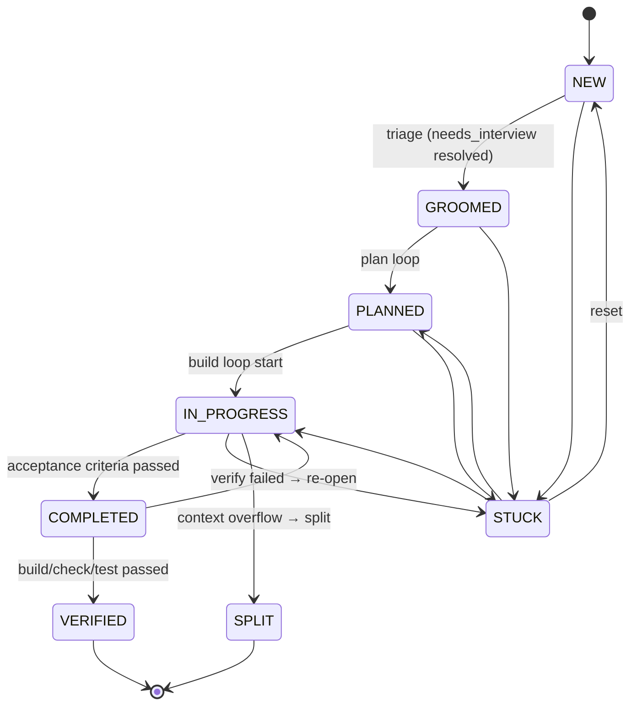

# Issue State Machine

**Source:** `src/core/issue/index.ts`

Issues are markdown files with YAML frontmatter. State is a field in frontmatter. All transitions are validated — never mutate `issue.state` directly; always use `validateTransition()`.

## States

```
NEW          Fresh issue, not yet triaged
GROOMED      Triaged, needs_interview resolved (ready to plan)
PLANNED      Plan file exists in planDir
IN_PROGRESS  Build loop is actively running
COMPLETED    Acceptance criteria passed, pre-complete gate passed
VERIFIED     Build/check/test passed post-completion (true terminal)
STUCK        Blocked — needs human intervention
SPLIT        Was too large; split into child issues (terminal)
```

## Issue Lifecycle Diagram



## Frontmatter Fields

```yaml
---
id: ISS-001
title: Add user authentication
state: IN_PROGRESS
parent: ~                         # parent issue id (if child of split)
children: []                      # child issue ids (if split)
split_count: 0                    # how many times this issue has been split
force_split: false                # override to force split on next overflow
needs_interview: false            # set by triage; true = append questions first
verify_count: 0                   # how many verification attempts
context_usage_percent: ~          # per-issue override (null = use config default)
total_input_tokens: 1240
total_output_tokens: 890
total_duration_seconds: 45.2
total_iterations: 3
run_count: 1
---
```

## Key Functions

| Function | Purpose | Location |
|----------|---------|---------|
| `parseIssue(content)` | Frontmatter markdown → Issue | `core/issue/index.ts` |
| `serializeIssue(issue)` | Issue → frontmatter markdown | `core/issue/index.ts` |
| `validateTransition(from, to)` | Check transition is legal | `core/issue/index.ts` |
| `parseAcceptanceCriteria(body)` | Check all `- [x]` ticked | `core/issue/index.ts` |

## Provider Operations

The `IssueProvider` base class (`core/issue/base.ts`) provides these shared methods:

- `transition(issue, nextState)` — validate + write
- `autoSelect(mode)` — pick next actionable issue by state priority
- `checkAcceptanceCriteria(issue)` — parse body, check all boxes ticked

Abstract I/O methods (implemented by local/github providers):

```
readIssue(id)   writeIssue(issue)   deleteIssue(id)
listIssues()    lockIssue(id)       unlockIssue(id)
isLocked(id)    initProject()
```

## Acceptance Criteria

Issues use GitHub-flavored checkbox syntax in their body:

```markdown
## Acceptance Criteria
- [x] Users can log in with email/password
- [x] Sessions expire after 24 hours
- [ ] Password reset email works   ← not ticked = not complete
```

`parseAcceptanceCriteria` returns `{ total, checked, allChecked }`. The build loop only transitions to COMPLETED when `allChecked === true`.
