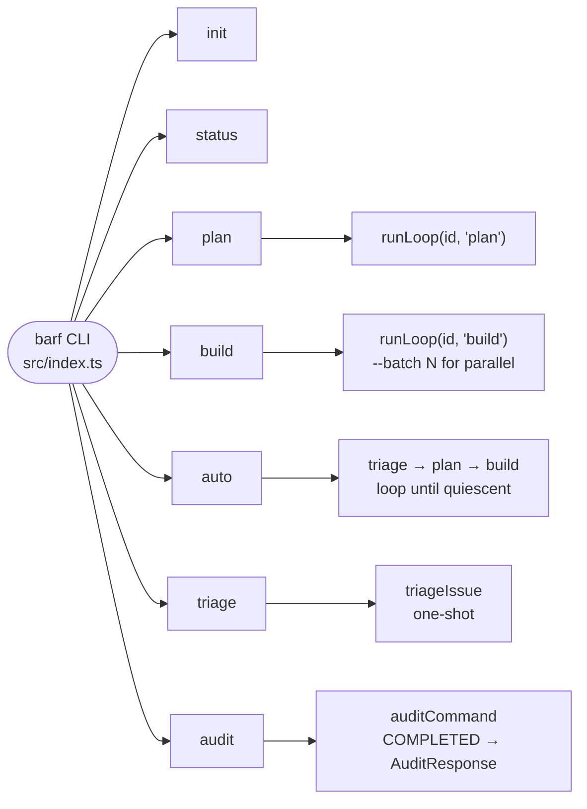
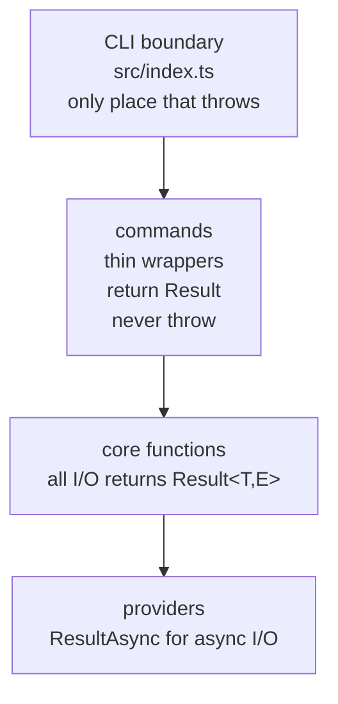

# Architecture Overview

barf-ts is a CLI that orchestrates Claude AI agents to work on issues (plan, build, verify). It wraps a project's codebase and manages an issue lifecycle — from triage through verified completion.

## Tech Stack

| Concern | Tool |
|---------|------|
| Runtime | Bun (TypeScript, no tsc needed) |
| AI | `@anthropic-ai/claude-agent-sdk` |
| Validation | Zod 4.x (schemas = source of truth) |
| Error handling | neverthrow (`Result<T,E>`) |
| Logging | Pino (structured JSON to stderr) |
| CLI | Commander.js |
| GitHub integration | `gh` CLI subprocess |
| Dashboard | Bun HTTP server + SSE + Vanilla TS frontend |

## Key Design Principles

- **No globals** — all state passed as function arguments
- **No thrown errors in core** — only at CLI boundary (`src/index.ts`)
- **Schema-first** — types inferred from Zod schemas, never defined separately
- **Provider abstraction** — issue storage (local files vs GitHub) is swappable
- **Prompt templating** — simple string replacement, files re-read per iteration

## Directory Map

```
src/
  index.ts                  CLI entry + error boundary
  cli/commands/             init | status | plan | build | auto | triage | audit
  core/
    batch/                  orchestration loop (plan/build/split/verify)
    claude/                 SDK wrapper, stream consumer, context management
    issue/                  state machine, provider interface, local+github providers
    triage/                 one-shot triage call
    verification/           post-COMPLETED build/check/test gates
    config.ts               .barfrc parser
    prompts.ts              prompt template resolution
    pre-complete.ts         pre-completion fix+test gate
  providers/                audit providers (openai | gemini | claude | codex)
  types/schema/             all Zod schemas
  utils/                    logger, execFileNoThrow, neverthrow helpers
  prompts/                  embedded PROMPT_*.md templates
tools/
  dashboard/                web UI (Bun HTTP, SSE, REST, Vanilla TS frontend)
tests/
  unit/                     413 tests across 38 files
  fixtures/                 mock providers, test helpers
  sample-project/           manual test project
resources/
  architecture/             (this directory) — design docs
  plans/                    numbered implementation plans
```

## CLI Command Flow



## Error Handling Layers



## See Also

- [`issue-state-machine.md`](./issue-state-machine.md) — issue lifecycle
- [`batch-loop.md`](./batch-loop.md) — orchestration engine
- [`claude-integration.md`](./claude-integration.md) — SDK + streaming
- [`providers.md`](./providers.md) — local vs GitHub issue storage
- [`triage.md`](./triage.md) — triage flow
- [`config.md`](./config.md) — configuration reference
- [`dashboard.md`](./dashboard.md) — web dashboard
