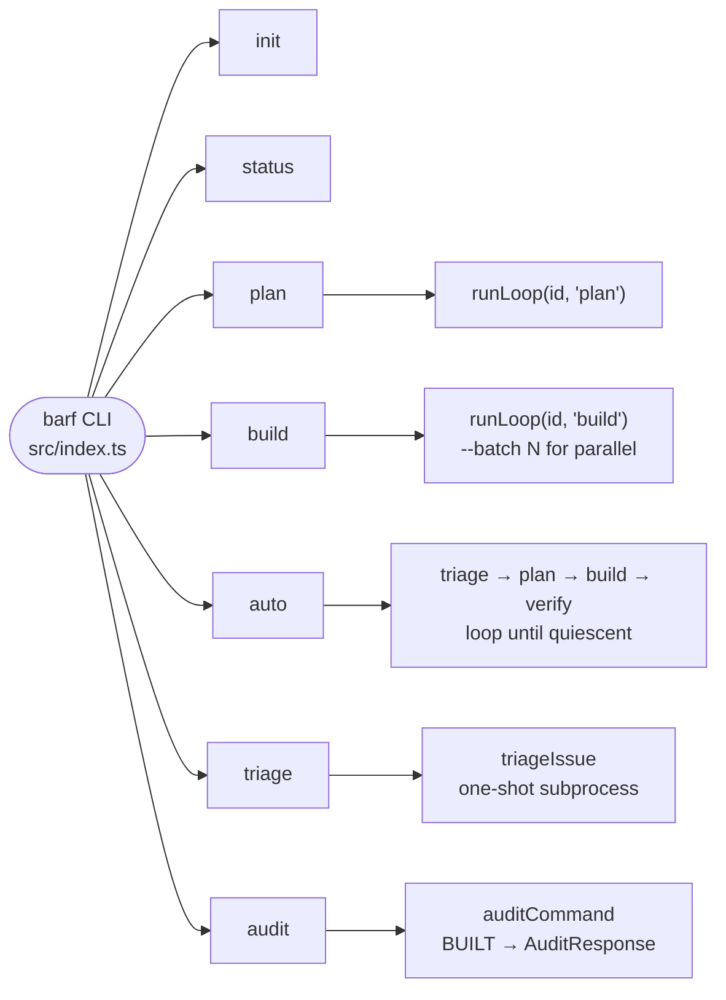
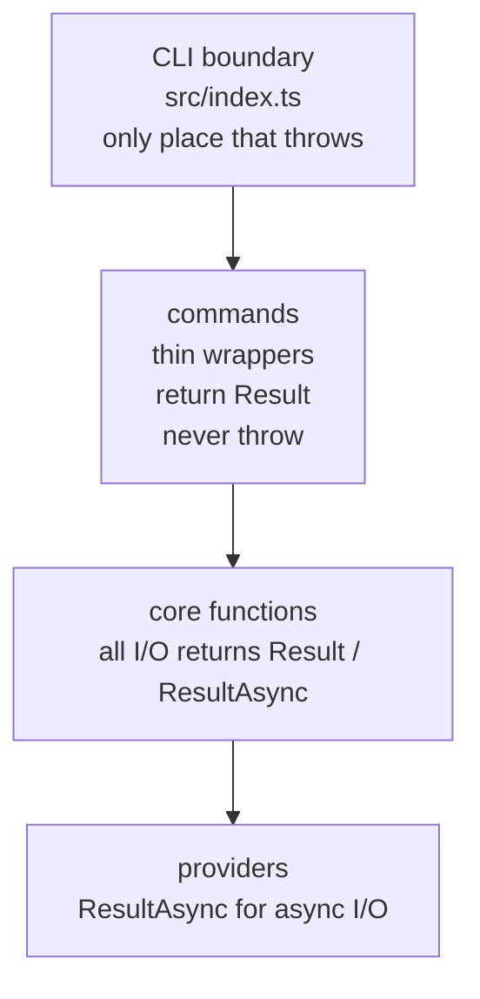
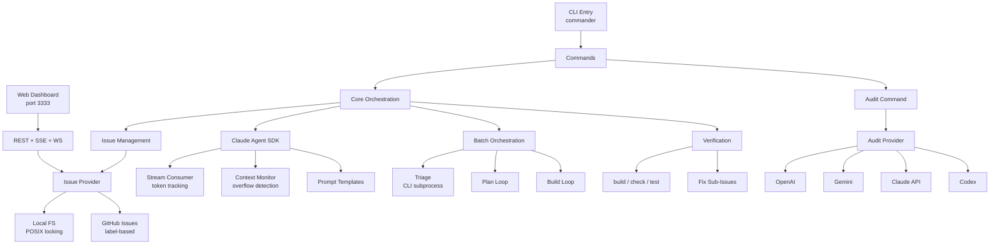

# Architecture Overview

barf-ts is a CLI that orchestrates Claude AI agents to work on issues (plan, build, verify). It wraps a project's codebase and manages an issue lifecycle — from triage through verified completion.

## Tech Stack

| Concern | Tool |
|---------|------|
| Runtime | Bun (TypeScript, no tsc needed) |
| AI (orchestration) | `@anthropic-ai/claude-agent-sdk` (plan/build/split) |
| AI (one-shot) | `claude` CLI subprocess (triage) |
| Validation | Zod 4.x (schemas = source of truth) |
| Error handling | neverthrow (`Result<T,E>` / `ResultAsync<T,E>`) |
| Logging | Pino (structured JSON to stderr + log file) |
| CLI | Commander.js |
| GitHub integration | `gh` CLI subprocess |
| Dashboard frontend | Preact + `@preact/signals` + DaisyUI + Tailwind CSS |
| Dashboard server | Bun HTTP + SSE + WebSocket |
| Audit providers | OpenAI, Gemini, Claude, Codex (pluggable) |

## Key Design Principles

- **No globals** — all state passed as function arguments (fixes bash-era race conditions)
- **No thrown errors in core** — only at CLI boundary (`src/index.ts`); all I/O returns `Result<T,E>`
- **Schema-first** — types inferred from Zod schemas, never defined separately
- **Provider abstraction** — issue storage (local files vs GitHub) is swappable via abstract class
- **Dependency injection** — all core functions accept injectable deps (`RunLoopDeps`, `AutoDeps`, `AuditDeps`, `ExecFn`) for testability
- **Prompt templating** — simple `$KEY` string replacement, files re-read per iteration when `PROMPT_DIR` set

## Directory Map

```
src/
  index.ts                  CLI entry + error boundary
  cli/commands/             init | status | plan | build | auto | triage | audit
  core/
    batch/                  orchestration loop (plan/build/split/verify)
    claude/                 SDK wrapper, stream consumer, context management
    issue/                  state machine, provider interface, local+github providers
    triage/                 one-shot triage call
    verification/           post-BUILT build/check/test gates
    config.ts               .barfrc parser
    context.ts              ContextOverflowError, RateLimitError, template var injection
    prompts.ts              prompt template resolution
    pre-complete.ts         pre-completion fix+test gate
  providers/                audit providers (openai | gemini | claude | codex)
  errors/                   InvalidTransitionError, ProviderError
  types/schema/             all Zod schemas (issue, config, lock, mode, etc.)
  utils/                    logger, execFileNoThrow, neverthrow helpers, sentry
  prompts/                  embedded PROMPT_*.md templates
tools/
  dashboard/                web UI (Bun HTTP, SSE, WebSocket, Preact frontend)
  playground-server.ts      legacy development server
tests/
  unit/                     488 tests across 42 files
  fixtures/                 mock providers, test helpers
  sample-project/           git submodule for manual testing
resources/
  architecture/             (this directory) — design docs
  plans/                    numbered implementation plans
```

## CLI Command Flow



## Error Handling Layers



## How the Pieces Connect



## See Also

- [`issue-state-machine.md`](./issue-state-machine.md) — issue lifecycle and frontmatter
- [`batch-loop.md`](./batch-loop.md) — orchestration engine
- [`claude-integration.md`](./claude-integration.md) — SDK + streaming + context
- [`providers.md`](./providers.md) — local vs GitHub issue storage
- [`triage.md`](./triage.md) — triage and interview flow
- [`config.md`](./config.md) — configuration reference
- [`dashboard.md`](./dashboard.md) — web dashboard
