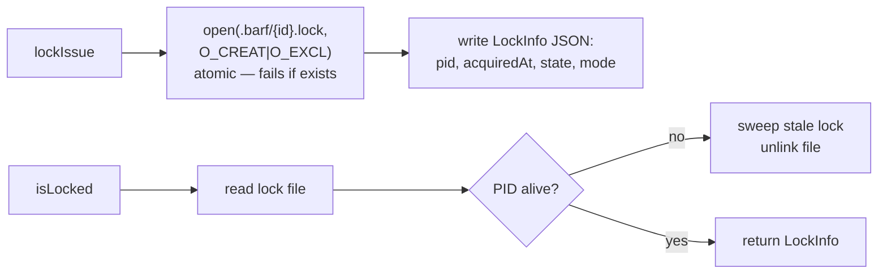
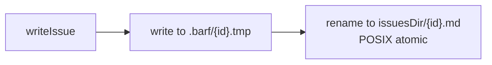

# Issue Providers

**Source:** `src/core/issue/`

The `IssueProvider` abstraction decouples barf's orchestration logic from where issues are stored. The same batch loop works whether issues are local markdown files or GitHub Issues.

## Provider Interface (`base.ts`)

```typescript
abstract class IssueProvider {
  // Abstract — must implement:
  abstract readIssue(id: string): ResultAsync<Issue, Error>
  abstract writeIssue(issue: Issue): ResultAsync<Issue, Error>
  abstract deleteIssue(id: string): ResultAsync<void, Error>
  abstract createIssue(opts: { title: string; body: string }): ResultAsync<Issue, Error>
  abstract listIssues(): ResultAsync<Issue[], Error>
  abstract lockIssue(id: string, info: LockInfo): ResultAsync<void, Error>
  abstract unlockIssue(id: string): ResultAsync<void, Error>
  abstract isLocked(id: string): ResultAsync<LockInfo | null, Error>
  abstract initProject(): ResultAsync<void, Error>

  // Provided (shared logic):
  transition(issue, nextState): ResultAsync<Issue, Error>   // validate + write
  autoSelect(mode): ResultAsync<Issue | null, Error>        // pick next actionable issue
  checkAcceptanceCriteria(issue): Result<CriteriaResult, Error>
}
```

## Factory (`factory.ts`)

```typescript
createIssueProvider(config: Config): IssueProvider
// Returns LocalIssueProvider or GitHubIssueProvider based on config.issueProvider
```

## Local Provider (`providers/local.ts`)

Issues stored as `.md` files in `issuesDir` (default: `issues/`).

### Locking: POSIX Atomic File Creation



Stale lock cleanup runs on every `isLocked` and `lockIssue` call — dead PIDs are automatically removed, preventing orphaned locks from crashes.

### Writes: Atomic via Temp File + Rename



## GitHub Provider (`providers/github.ts`)

Issues mapped to GitHub Issues via the `gh` CLI.

### State → Label Mapping

```
NEW          → barf:new
GROOMED      → barf:groomed
PLANNED      → barf:planned
IN_PROGRESS  → barf:in-progress
COMPLETED    → barf:completed
VERIFIED     → barf:verified
STUCK        → barf:stuck
SPLIT        → barf:split
```

Labels defined in `providers/github-labels.ts`.

### Locking: Label-Based

```
lockIssue:    add label "barf:locked" via gh CLI
unlockIssue:  remove label "barf:locked"
isLocked:     check for "barf:locked" label
```

**Not atomic** — designed for single-agent use only.

### Constraints vs Local

- Cannot `deleteIssue` — transitions to COMPLETED instead
- Locking is not atomic; designed for single-agent use
- Issue body = markdown content; frontmatter stored in issue body header
- `initProject()` creates barf labels in the GitHub repo (idempotent)
- Requires `gh auth login`

## LockInfo Schema

```typescript
const LockInfoSchema = z.object({
  pid: z.number().int().positive(),        // process ID that holds the lock
  acquiredAt: z.string().datetime(),       // ISO 8601 when lock was acquired
  state: IssueStateSchema,                 // issue state at lock time
  mode: LockModeSchema,                   // 'plan' | 'build' | 'split'
})
```

## autoSelect Logic

Picks the next issue to work on based on priority ordering:

```
build mode:   IN_PROGRESS → PLANNED → (nothing)
plan mode:    GROOMED → (nothing)
triage mode:  NEW (needs_interview=undefined) → (nothing)
```

Skips locked issues. Returns `null` if nothing actionable.

## Audit Providers (separate system)

Not to be confused with issue providers — audit providers are in `src/providers/` and handle AI-based code review. See the [config reference](./config.md) for audit provider settings.
