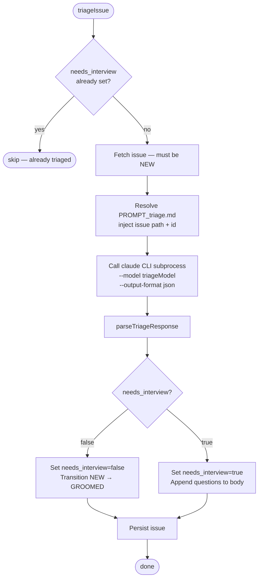
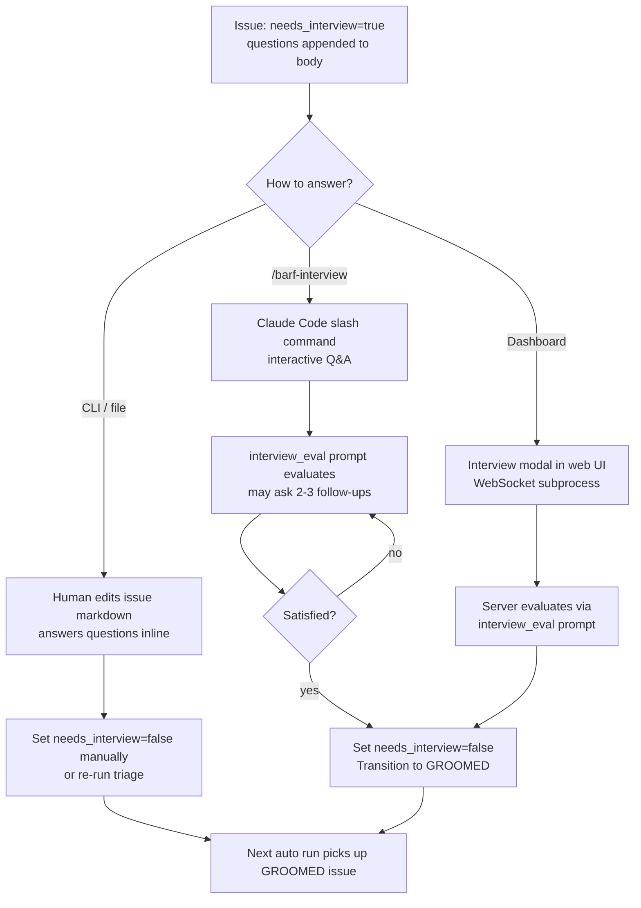

# Triage System

**Source:** `src/core/triage/`

Triage is a one-shot Claude evaluation of NEW issues. It determines whether an issue has enough information to plan immediately, or needs clarifying questions first.

## Flow



## Why CLI Subprocess?

Triage uses `claude -p <prompt> --model <model> --output-format json` instead of the Claude Agent SDK. This is deliberate:
- One-shot call (no multi-turn iteration needed)
- Simpler — no stream consumer, no token tracking, no overflow handling
- Fast startup — haiku model completes in <10 seconds

## Output

Claude returns JSON. `parseTriageResponse()` handles common edge cases (markdown fences, surrounding prose):

```json
{ "needs_interview": false }

{
  "needs_interview": true,
  "questions": [
    { "question": "What authentication method should be used?", "options": ["JWT", "OAuth2"] },
    { "question": "Should sessions persist across browser restarts?" }
  ]
}
```

## needs_interview Flag

```
undefined   issue hasn't been triaged yet (triage will run)
false       ready to plan — no clarification needed
true        questions appended to issue body, waits for human answers
```

In `auto` mode, triage runs on all NEW issues where `needs_interview === undefined`. Issues with `needs_interview=true` are skipped for planning — they need interview answers first.

## Interview Flow

When triage sets `needs_interview=true`:



## Questions Format

Questions are appended as a dedicated section in the issue body by `formatQuestionsSection()`:

```markdown
## Interview Questions

1. What authentication method should be used?
   - JWT
   - OAuth2
2. Should sessions persist across browser restarts?
```

## Key Files

| File | Purpose |
|------|---------|
| `triage/triage.ts` | `triageIssue()` entry point |
| `triage/parse.ts` | `parseTriageResponse()`, `formatQuestionsSection()` |
| `prompts/PROMPT_triage.md` | Triage prompt template |
| `prompts/PROMPT_interview.md` | Interactive interview prompt (planned, not yet integrated) |
| `prompts/PROMPT_interview_eval.md` | Interview answer evaluation prompt |
