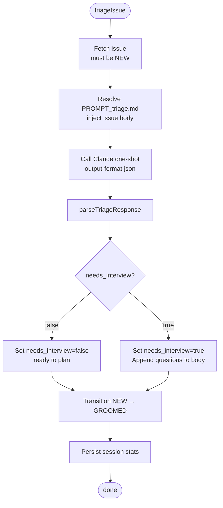
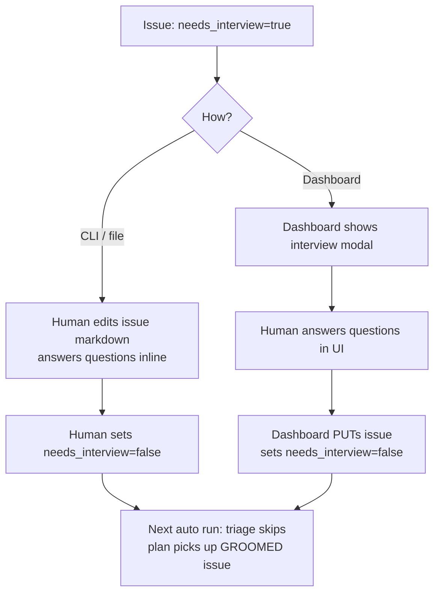

# Triage System

**Source:** `src/core/triage/`

Triage is a one-shot Claude evaluation of NEW issues. It determines whether an issue has enough information to plan immediately, or needs clarifying questions first.

## Flow



## Output

Claude returns JSON. The `parseTriageResponse` function handles both envelope formats (current array format and legacy object format):

```json
{ "needs_interview": false }

{ "needs_interview": true, "questions": [
    "What authentication method should be used?",
    "Should sessions be persistent across browser restarts?"
]}
```

## needs_interview Flag

```
undefined   issue hasn't been triaged yet (triage will run)
false       ready to plan — no clarification needed
true        questions appended to issue body, waits for human
```

In `auto` mode, triage runs on all NEW issues where `needs_interview === undefined` before any planning starts.

## Interview Flow (when needs_interview = true)



## Questions Format

Questions are appended as a dedicated section in the issue body:

```markdown
## Interview Questions

Please answer the following questions to clarify requirements:

1. What authentication method should be used?
2. Should sessions be persistent across browser restarts?

---
```

## Triage Prompt

The `PROMPT_triage.md` template instructs Claude to:
- Read the issue title and body
- Determine if requirements are clear enough to plan
- Return JSON with `needs_interview` and optional `questions`

## Key Files

| File | Purpose |
|------|---------|
| `triage/triage.ts` | `triageIssue` entry point |
| `triage/parse.ts` | `parseTriageResponse`, `formatQuestionsSection` |
| `prompts/PROMPT_triage.md` | embedded triage prompt template |
